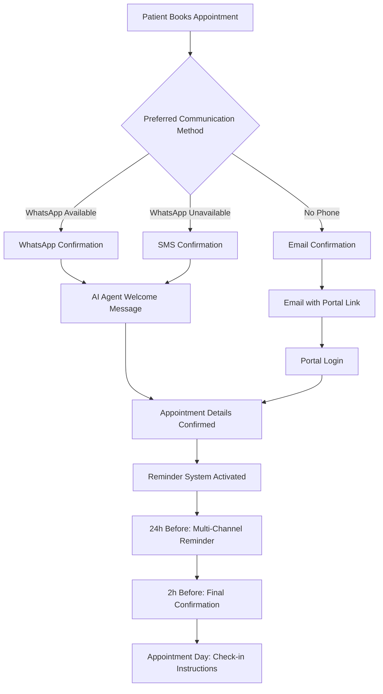
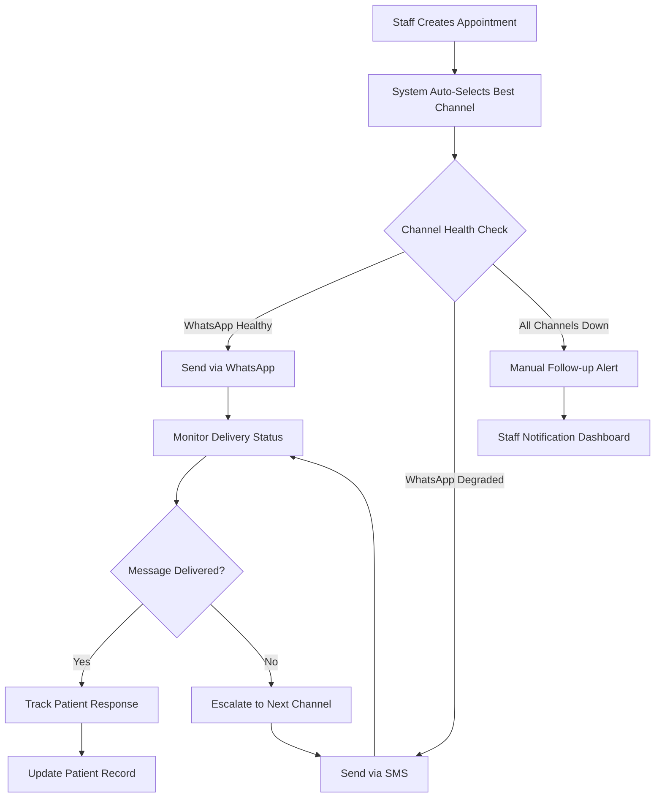
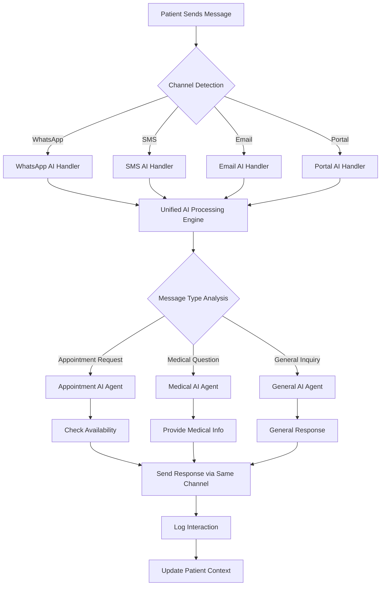
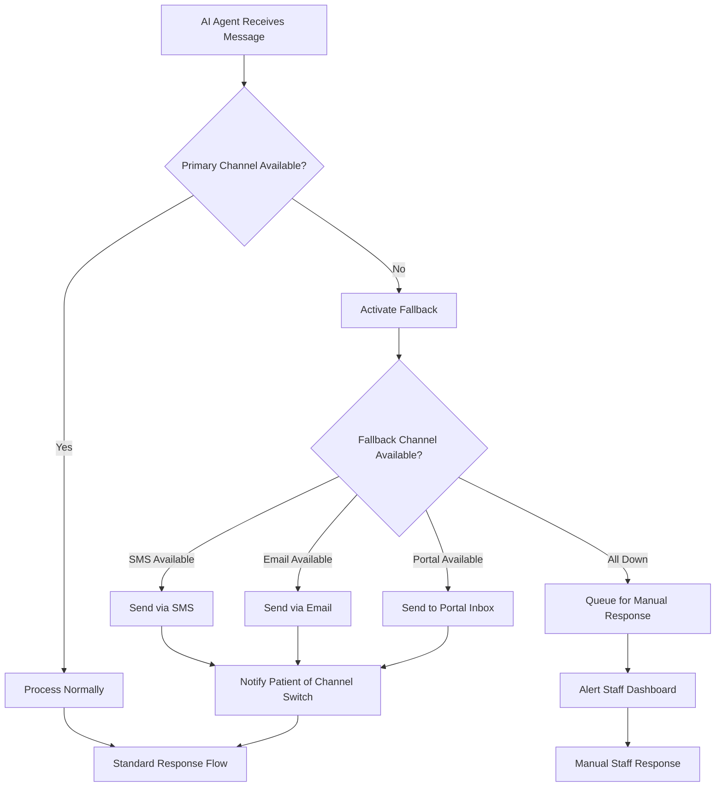
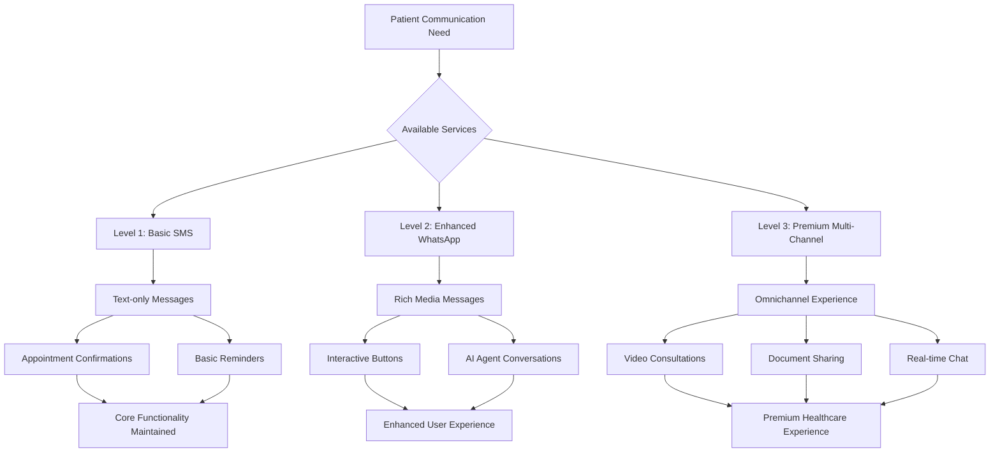
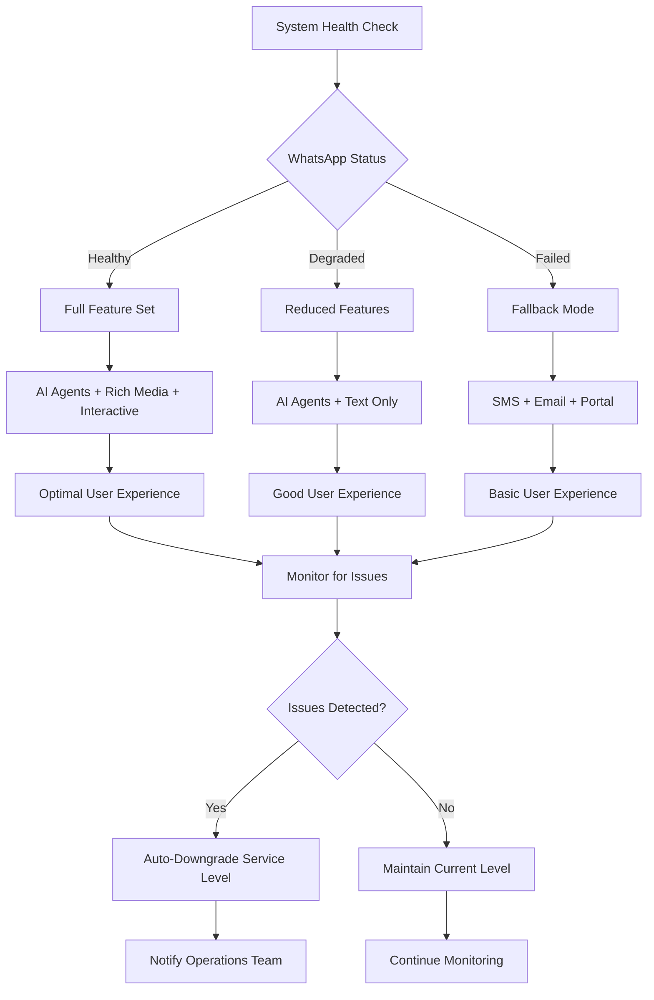
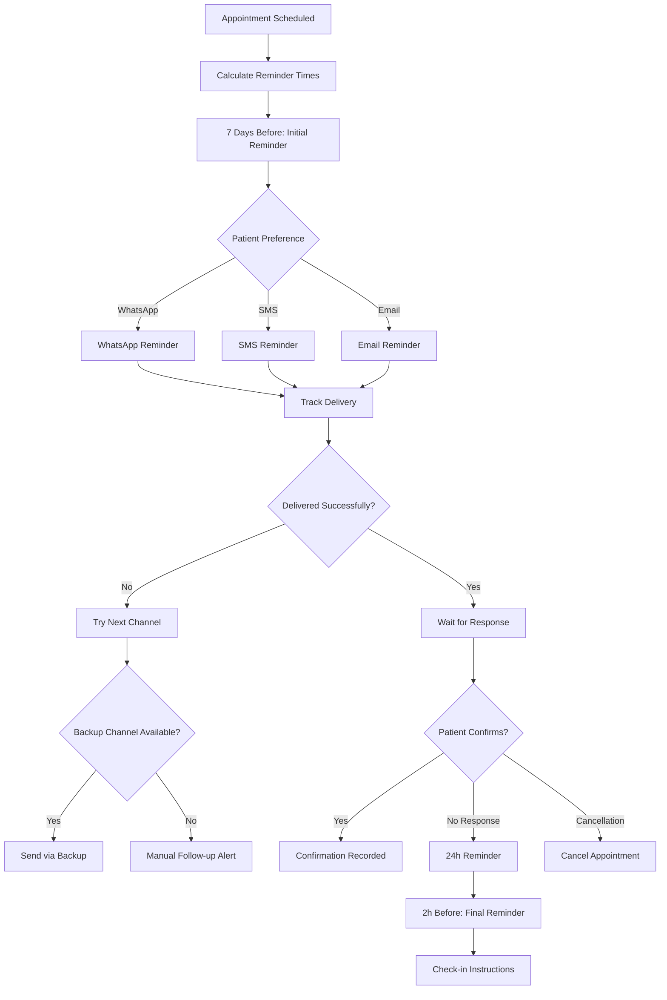
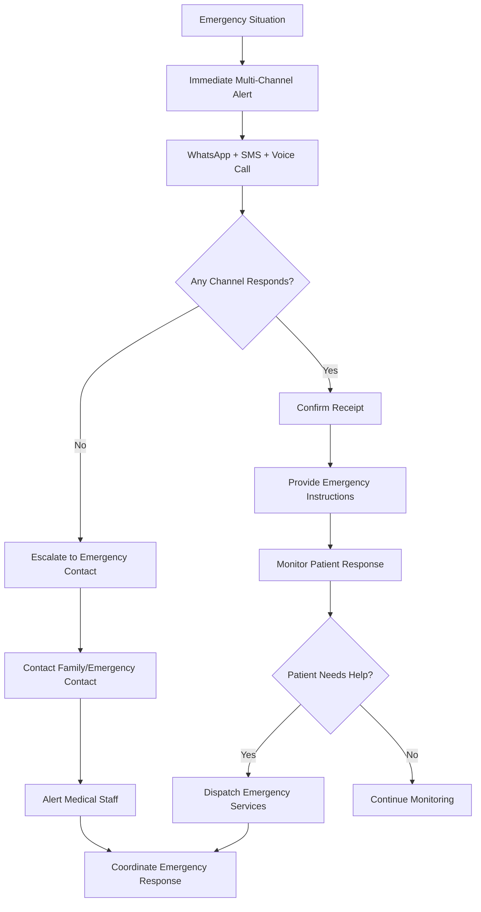
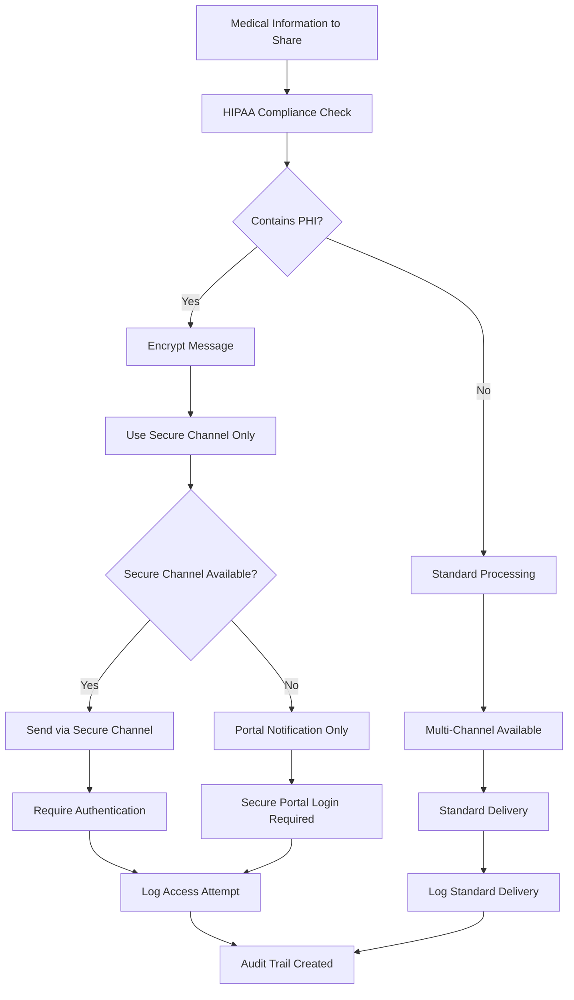
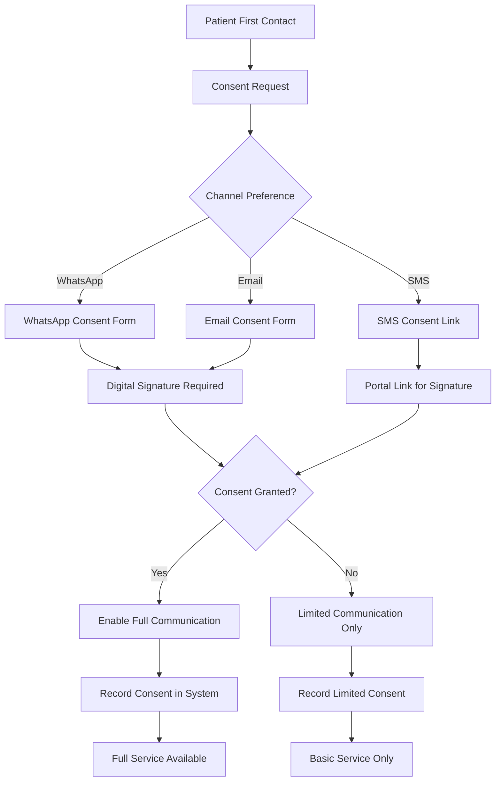

# 🔄 **WHATSAPP USER FLOWS REDESIGN**

## 📊 **FLOW ARCHITECTURE REDESIGN**

### **A. Current vs Redesigned Flow Comparison**

#### **❌ CURRENT PROBLEMATIC FLOW:**
```
Patient Books Appointment
         ↓
WhatsApp Instance Required ← [SINGLE POINT OF FAILURE]
         ↓
QR Code Generation ← [INFINITE LOOPS HERE]
         ↓
Manual Phone Scanning ← [USER FRICTION]
         ↓
Connection Monitoring ← [INFINITE LOOPS HERE]
         ↓
AI Agent Activation ← [BLOCKED IF WHATSAPP FAILS]
```

#### **✅ REDESIGNED RESILIENT FLOW:**
```
Patient Books Appointment
         ↓
Multi-Channel Notification System
    ↓         ↓         ↓
WhatsApp   SMS      Email    ← [MULTIPLE CHANNELS]
    ↓         ↓         ↓
AI Agent Available on All Channels ← [NO SINGLE POINT OF FAILURE]
         ↓
Progressive Enhancement
    ↓         ↓         ↓
Basic     Enhanced   Premium ← [GRACEFUL DEGRADATION]
```

---

## 🎯 **REDESIGNED USER FLOWS**

### **Flow 1: Appointment Booking (Multi-Channel)**

#### **A. Patient Perspective:**


#### **B. Staff Perspective:**


### **Flow 2: AI Agent Interaction (Channel Agnostic)**

#### **A. Multi-Channel AI Agent Flow:**


#### **B. Fallback Mechanism Flow:**


### **Flow 3: Progressive Enhancement Strategy**

#### **A. Service Level Tiers:**


#### **B. Graceful Degradation Flow:**


---

## 🏥 **HEALTHCARE-SPECIFIC FLOWS**

### **Flow 4: Appointment Reminder System**

#### **A. Multi-Channel Reminder Flow:**


#### **B. Emergency Communication Flow:**


### **Flow 5: HIPAA-Compliant Communication**

#### **A. Secure Message Flow:**


#### **B. Consent Management Flow:**


---

## 🔧 **IMPLEMENTATION PRIORITIES**

### **Phase 1: Foundation (Week 1)**
```
Priority 1: Multi-Channel Infrastructure
├── SMS Integration (Twilio)
├── Email Integration (SendGrid/AWS SES)
├── Portal Messaging System
└── Channel Health Monitoring

Priority 2: Fallback Mechanisms
├── Automatic Channel Switching
├── Delivery Status Tracking
├── Failure Detection and Recovery
└── Manual Override Capabilities
```

### **Phase 2: Enhanced Features (Week 2)**
```
Priority 1: AI Agent Multi-Channel
├── Channel-Agnostic AI Processing
├── Context Preservation Across Channels
├── Response Format Adaptation
└── Conversation Threading

Priority 2: Progressive Enhancement
├── Feature Detection by Channel
├── Graceful Degradation Logic
├── Service Level Management
└── User Experience Optimization
```

### **Phase 3: Healthcare Compliance (Week 3)**
```
Priority 1: HIPAA Compliance
├── Secure Message Encryption
├── Audit Trail Implementation
├── Consent Management System
└── Access Control Enforcement

Priority 2: Emergency Protocols
├── Emergency Communication Flows
├── Escalation Procedures
├── Staff Alert Systems
└── Emergency Contact Management
```

### **Phase 4: Optimization (Week 4)**
```
Priority 1: Performance Optimization
├── Message Delivery Optimization
├── Response Time Improvement
├── Resource Usage Optimization
└── Scalability Testing

Priority 2: Analytics and Monitoring
├── Communication Analytics
├── Channel Performance Metrics
├── Patient Engagement Tracking
└── System Health Dashboards
```

---

## 📈 **SUCCESS METRICS**

### **Technical Metrics:**
- **Multi-Channel Delivery Rate:** 99.5%
- **Fallback Activation Time:** < 30 seconds
- **Channel Switch Success Rate:** 95%
- **Message Processing Time:** < 2 seconds

### **User Experience Metrics:**
- **Patient Satisfaction:** 90%+
- **Communication Preference Fulfillment:** 85%+
- **Response Rate Improvement:** 40%+
- **Support Ticket Reduction:** 60%+

### **Business Metrics:**
- **Appointment No-show Reduction:** 30%
- **Staff Efficiency Improvement:** 50%
- **Communication Cost Reduction:** 25%
- **System Reliability:** 99.9% uptime

---

## 🎯 **IMMEDIATE IMPLEMENTATION STEPS**

### **Week 1 Actions:**
1. **Set up SMS Integration** - Twilio account and basic SMS sending
2. **Implement Channel Health Monitoring** - Real-time status checking
3. **Create Fallback Logic** - Automatic channel switching
4. **Build Multi-Channel Message Queue** - Unified message processing

### **Success Criteria:**
- ✅ SMS fallback working when WhatsApp fails
- ✅ Automatic channel switching in < 30 seconds
- ✅ No single point of failure in communication
- ✅ Basic multi-channel appointment reminders functional

**🎉 This redesigned flow architecture eliminates WhatsApp as a single point of failure while providing a superior, more reliable patient communication experience.**
