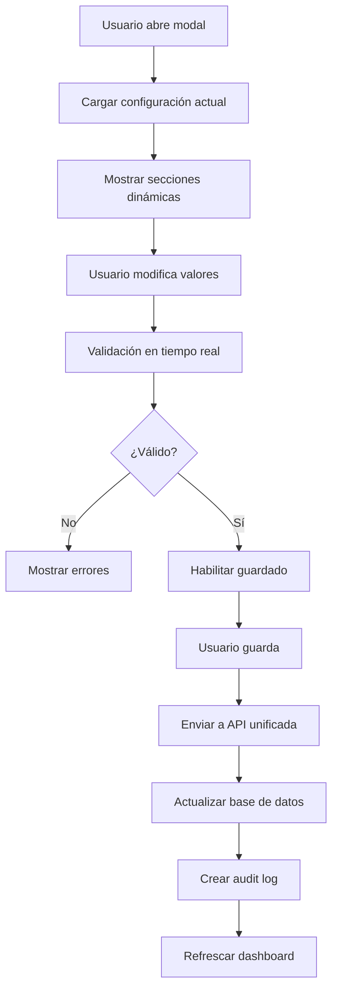
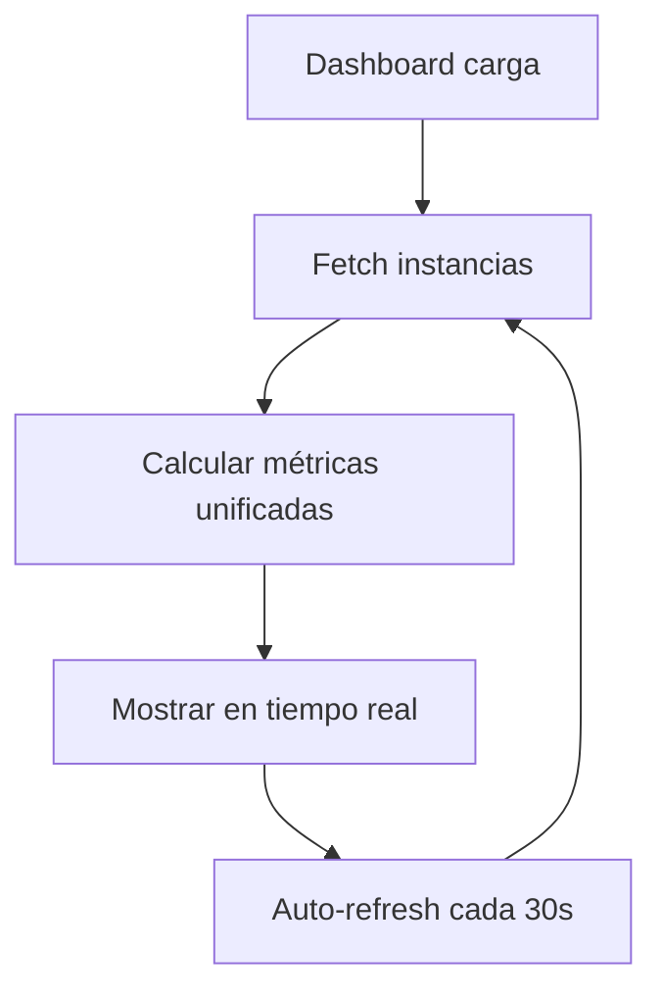

# 🏗️ **ARQUITECTURA DEL SISTEMA MULTI-CANAL**

## 📋 **Tabla de Contenidos**

1. [Visión General](#visión-general)
2. [Arquitectura de Componentes](#arquitectura-de-componentes)
3. [APIs Unificadas](#apis-unificadas)
4. [Sistema de Configuración](#sistema-de-configuración)
5. [Flujos de Datos](#flujos-de-datos)
6. [Seguridad y Validación](#seguridad-y-validación)
7. [Testing y Calidad](#testing-y-calidad)
8. [Guías de Desarrollo](#guías-de-desarrollo)

---

## 🎯 **Visión General**

El Sistema Multi-Canal de AgentSalud MVP es una arquitectura unificada que permite gestionar múltiples canales de comunicación (WhatsApp, Telegram, Voice, SMS, Email) desde una interfaz centralizada, manteniendo compatibilidad total con el sistema WhatsApp existente.

### **Objetivos Principales**

- ✅ **Unificación**: Interfaz única para gestionar todos los canales
- ✅ **Escalabilidad**: Fácil adición de nuevos tipos de canal
- ✅ **Compatibilidad**: 100% compatible con sistema WhatsApp existente
- ✅ **Performance**: Optimizado para respuesta rápida y alta concurrencia
- ✅ **Mantenibilidad**: Código modular y bien documentado

### **Tecnologías Utilizadas**

- **Frontend**: React 18, TypeScript, Tailwind CSS v4
- **Backend**: Next.js 14 API Routes, Supabase
- **Testing**: Jest, React Testing Library, Custom E2E Framework
- **Validación**: Zod Schemas, TypeScript Interfaces
- **Documentación**: JSDoc, Markdown

---

## 🏗️ **Arquitectura de Componentes**

### **Estructura de Directorios**

```
src/
├── components/
│   └── channels/
│       ├── ChannelDashboard.tsx          # Dashboard principal
│       ├── ChannelInstanceCard.tsx       # Card genérico de instancia
│       ├── ChannelConfigModal.tsx        # Modal de configuración
│       └── config-sections/              # Secciones de configuración
│           ├── GeneralConfigSection.tsx
│           ├── WebhookConfigSection.tsx
│           ├── AIConfigSection.tsx
│           └── WhatsAppConfigSection.tsx
├── app/api/channels/                     # APIs unificadas
│   └── whatsapp/
│       ├── instances/
│       ├── webhook/
│       └── appointments/
├── types/
│   └── channels.ts                       # Tipos unificados
└── lib/
    └── channels/
        └── whatsapp/                     # Servicios WhatsApp
```

### **Componentes Principales**

#### **1. ChannelDashboard.tsx**
- **Propósito**: Dashboard principal multi-canal
- **Responsabilidades**:
  - Mostrar métricas unificadas en tiempo real
  - Gestionar tabs por tipo de canal
  - Integrar con APIs unificadas
  - Manejar estados de carga y error

#### **2. ChannelInstanceCard.tsx**
- **Propósito**: Componente genérico para mostrar instancias
- **Características**:
  - Adaptable a cualquier tipo de canal
  - Iconos y colores dinámicos por canal
  - Estados visuales (connected, disconnected, error, etc.)
  - Acciones integradas (configurar, conectar, eliminar)

#### **3. ChannelConfigModal.tsx**
- **Propósito**: Modal unificado de configuración
- **Características**:
  - Sistema de tabs dinámico
  - Carga lazy de secciones
  - Validación en tiempo real
  - Manejo de estados de guardado

---

## 🔌 **APIs Unificadas**

### **Estructura de Endpoints**

```
/api/channels/
├── whatsapp/
│   ├── instances/                    # CRUD de instancias
│   │   ├── GET    /                  # Listar instancias
│   │   ├── POST   /                  # Crear instancia
│   │   └── [id]/
│   │       ├── GET    /              # Obtener instancia
│   │       ├── PUT    /              # Actualizar configuración
│   │       ├── DELETE /              # Eliminar instancia
│   │       ├── status/
│   │       │   ├── GET  /            # Estado actual
│   │       │   └── POST /            # Acciones (connect/disconnect)
│   │       └── qrcode/
│   │           ├── GET  /            # Obtener QR
│   │           └── POST /            # Refrescar QR
│   ├── webhook/                      # Webhook unificado
│   │   ├── GET    /                  # Health check
│   │   └── POST   /                  # Procesar eventos
│   └── appointments/                 # Gestión de citas
│       ├── GET    /                  # Consultar citas
│       └── POST   /                  # Procesar solicitudes
```

### **Formato de Respuesta Unificado**

```typescript
interface UnifiedAPIResponse<T> {
  success: boolean;
  data?: T;
  error?: {
    code: string;
    message: string;
    details?: Record<string, string>;
  };
  meta: {
    timestamp: string;
    requestId: string;
    organizationId?: string;
    channel?: string;
  };
}
```

### **Códigos de Error Estándar**

- `VALIDATION_ERROR`: Errores de validación de entrada
- `NOT_FOUND`: Recurso no encontrado
- `FORBIDDEN`: Sin permisos para la operación
- `INTERNAL_SERVER_ERROR`: Error interno del servidor
- `EXTERNAL_API_ERROR`: Error en API externa (Evolution API)
- `RATE_LIMIT_EXCEEDED`: Límite de velocidad excedido

---

## ⚙️ **Sistema de Configuración**

### **Secciones de Configuración**

#### **1. General (GeneralConfigSection)**
- Auto-reply toggle
- Límites del sistema (chats concurrentes, rate limits)
- Timeouts de sesión
- Información de instancia

#### **2. Webhook (WebhookConfigSection)**
- URL de webhook con validación
- Gestión de secretos (generación automática)
- Suscripción a eventos (7 tipos disponibles)
- Test de conectividad

#### **3. IA (AIConfigSection)**
- Selección de modelo (GPT-3.5, GPT-4, GPT-4 Turbo)
- Parámetros (temperatura, tokens, timeout)
- Presets de creatividad
- Prompt personalizado

#### **4. WhatsApp (WhatsAppConfigSection)**
- Configuración de Evolution API
- Gestión de códigos QR
- Features de WhatsApp (read receipts, typing indicator)
- Test de conexión

### **Validación de Configuración**

```typescript
// Ejemplo de validación Zod
const WhatsAppConfigSchema = z.object({
  phone_number: z.string().regex(/^\+\d{10,15}$/),
  evolution_api: z.object({
    base_url: z.string().url(),
    api_key: z.string().min(1),
    instance_name: z.string().min(1)
  })
});
```

---

## 🔄 **Flujos de Datos**

### **Flujo de Configuración**



### **Flujo de Métricas**



---

## 🔒 **Seguridad y Validación**

### **Autenticación y Autorización**

- **Roles soportados**: patient, doctor, staff, admin, superadmin
- **Permisos por rol**:
  - `admin/superadmin`: Acceso completo a configuración
  - `staff`: Acceso limitado a métricas
  - `doctor/patient`: Solo lectura

### **Validación de Datos**

- **Frontend**: Validación en tiempo real con Zod
- **Backend**: Validación de schemas en APIs
- **Base de datos**: Constraints y triggers
- **Sanitización**: Escape de HTML y SQL injection prevention

### **Audit Trail**

```typescript
interface UnifiedAuditLog {
  id: string;
  organization_id: string;
  user_id: string;
  action: string;
  resource_type: 'channel_instance' | 'configuration';
  resource_id: string;
  changes: Record<string, any>;
  timestamp: string;
  ip_address?: string;
  user_agent?: string;
}
```

---

## 🧪 **Testing y Calidad**

### **Estrategia de Testing**

#### **1. Tests Unitarios (>80% cobertura)**
- Componentes individuales
- Funciones de utilidad
- Validaciones de schemas

#### **2. Tests de Integración**
- Flujos API completos
- Integración Dashboard ↔ Modal ↔ APIs
- Validación de datos end-to-end

#### **3. Tests E2E**
- Flujos de usuario completos
- Configuración → Guardado → Actualización
- Manejo de errores y estados de carga

#### **4. Tests de Performance**
- Tiempos de respuesta de APIs (<1s para GET, <2s para POST/PUT)
- Concurrencia (10+ requests simultáneas)
- Optimización de payloads

#### **5. Tests de UX/Accesibilidad**
- ARIA labels y roles
- Navegación por teclado
- Responsive design
- Estados de carga y error

### **Métricas de Calidad**

- **Cobertura de Tests**: >80% para código crítico
- **Performance**: APIs <1s, UI <100ms
- **Accesibilidad**: WCAG 2.1 AA compliance
- **Límites de Archivo**: <500 líneas por archivo
- **Documentación**: JSDoc completo

---

## 👨‍💻 **Guías de Desarrollo**

### **Agregar Nuevo Tipo de Canal**

1. **Definir tipos en `@/types/channels`**:
```typescript
interface TelegramChannelConfig {
  bot_token: string;
  webhook_url: string;
  allowed_updates: string[];
}
```

2. **Crear sección de configuración**:
```typescript
// config-sections/TelegramConfigSection.tsx
export const TelegramConfigSection: React.FC<ConfigSectionProps> = ({
  config, onUpdate, errors
}) => {
  // Implementación específica de Telegram
};
```

3. **Agregar al modal**:
```typescript
// En ChannelConfigModal.tsx
if (instance?.channel_type === 'telegram') {
  sections.push({
    id: 'telegram',
    title: 'Telegram',
    component: TelegramConfigSection
  });
}
```

4. **Implementar APIs**:
```typescript
// /api/channels/telegram/instances/route.ts
export async function GET() {
  // Implementación para Telegram
}
```

### **Mejores Prácticas**

#### **Componentes**
- Usar TypeScript estricto
- Implementar JSDoc completo
- Mantener <500 líneas por archivo
- Seguir patrones de composición

#### **APIs**
- Usar formato de respuesta unificado
- Implementar validación Zod
- Manejar errores consistentemente
- Crear audit logs para cambios

#### **Testing**
- Escribir tests antes de implementar
- Cubrir casos edge y errores
- Usar mocks apropiados
- Validar accesibilidad

#### **Performance**
- Lazy loading para secciones
- Debounce para validaciones
- Optimizar payloads de API
- Implementar caching apropiado

---

## 📚 **Referencias**

- [Documentación de APIs](./API_DOCUMENTATION.md)
- [Guía de Testing](./TESTING_GUIDE.md)
- [Guía de Contribución](./CONTRIBUTING.md)
- [Changelog](./CHANGELOG.md)

---

**Última actualización**: 2025-01-28  
**Versión**: 1.0.0  
**Mantenido por**: AgentSalud Development Team
