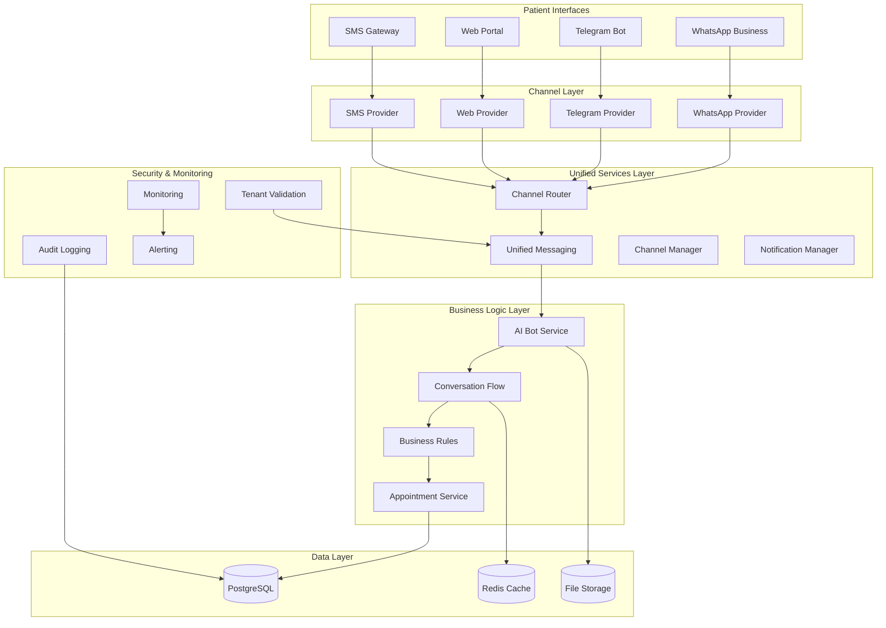

# Multi-Channel Architecture Design

## Overview

This document outlines the comprehensive multi-channel architecture for AgentSalud, supporting WhatsApp, Telegram, and future communication channels through a unified, scalable, and maintainable system.

## 1. High-Level Architecture



## 2. Channel Provider Architecture

### 2.1 Unified Channel Interface

```typescript
/**
 * Universal channel provider interface
 * Abstracts platform-specific implementations
 */
interface ChannelProvider {
  // Core messaging capabilities
  sendMessage(recipient: string, message: string, options?: MessageOptions): Promise<MessageResult>;
  sendTemplate(recipient: string, template: MessageTemplate): Promise<MessageResult>;
  sendMedia(recipient: string, media: MediaContent): Promise<MessageResult>;
  
  // Interactive features
  sendInteractiveMessage(recipient: string, interactive: InteractiveMessage): Promise<MessageResult>;
  handleInteraction(interaction: UserInteraction): Promise<InteractionResult>;
  
  // Instance management
  createInstance(config: ChannelConfig): Promise<InstanceResult>;
  validateInstance(instanceId: string): Promise<ValidationResult>;
  getInstanceStatus(instanceId: string): Promise<StatusResult>;
  updateInstance(instanceId: string, config: Partial<ChannelConfig>): Promise<UpdateResult>;
  deleteInstance(instanceId: string): Promise<DeleteResult>;
  
  // Webhook handling
  handleWebhook(payload: any, signature?: string): Promise<WebhookResult>;
  verifyWebhook(signature: string, payload: string): boolean;
  setupWebhook(instanceId: string, webhookUrl: string): Promise<WebhookSetupResult>;
  
  // Channel-specific features
  getChannelCapabilities(): ChannelCapabilities;
  formatMessage(message: UniversalMessage): PlatformSpecificMessage;
  parseIncomingMessage(payload: any): UniversalMessage;
}
```

### 2.2 WhatsApp Business API Provider

```typescript
class WhatsAppBusinessProvider implements ChannelProvider {
  private baseURL = 'https://graph.facebook.com/v18.0';
  private accessToken: string;
  
  async sendMessage(
    phoneNumber: string, 
    message: string, 
    options?: WhatsAppMessageOptions
  ): Promise<MessageResult> {
    const payload = {
      messaging_product: "whatsapp",
      to: phoneNumber,
      type: "text",
      text: { body: message }
    };
    
    if (options?.replyToMessageId) {
      payload.context = { message_id: options.replyToMessageId };
    }
    
    return this.makeAPICall('/messages', payload);
  }
  
  async sendTemplate(
    phoneNumber: string, 
    template: WhatsAppTemplate
  ): Promise<MessageResult> {
    const payload = {
      messaging_product: "whatsapp",
      to: phoneNumber,
      type: "template",
      template: {
        name: template.name,
        language: { code: template.language },
        components: template.components
      }
    };
    
    return this.makeAPICall('/messages', payload);
  }
  
  async sendInteractiveMessage(
    phoneNumber: string, 
    interactive: WhatsAppInteractive
  ): Promise<MessageResult> {
    const payload = {
      messaging_product: "whatsapp",
      to: phoneNumber,
      type: "interactive",
      interactive
    };
    
    return this.makeAPICall('/messages', payload);
  }
  
  getChannelCapabilities(): ChannelCapabilities {
    return {
      supportsTemplates: true,
      supportsInteractiveButtons: true,
      supportsInlineKeyboards: false,
      supportsCommands: false,
      supportsFileUpload: true,
      maxFileSize: 100 * 1024 * 1024, // 100MB
      supportedFileTypes: ['image/*', 'video/*', 'audio/*', 'application/pdf'],
      supportsWebApps: false,
      supportsCustomKeyboards: false
    };
  }
}
```

### 2.3 Telegram Provider

```typescript
class TelegramProvider implements ChannelProvider {
  private botToken: string;
  private apiUrl = 'https://api.telegram.org/bot';
  
  async sendMessage(
    chatId: string, 
    message: string, 
    options?: TelegramMessageOptions
  ): Promise<MessageResult> {
    const payload = {
      chat_id: chatId,
      text: message,
      parse_mode: options?.parseMode || 'HTML',
      reply_markup: options?.replyMarkup
    };
    
    if (options?.replyToMessageId) {
      payload.reply_to_message_id = options.replyToMessageId;
    }
    
    return this.makeAPICall('/sendMessage', payload);
  }
  
  async sendInteractiveMessage(
    chatId: string, 
    interactive: TelegramInteractive
  ): Promise<MessageResult> {
    const keyboard = this.buildInlineKeyboard(interactive.buttons);
    
    return this.sendMessage(chatId, interactive.text, {
      replyMarkup: { inline_keyboard: keyboard }
    });
  }
  
  async handleWebhook(payload: TelegramUpdate): Promise<WebhookResult> {
    if (payload.message) {
      return this.handleMessage(payload.message);
    } else if (payload.callback_query) {
      return this.handleCallbackQuery(payload.callback_query);
    } else if (payload.inline_query) {
      return this.handleInlineQuery(payload.inline_query);
    }
    
    return { success: true, message: 'Update processed' };
  }
  
  getChannelCapabilities(): ChannelCapabilities {
    return {
      supportsTemplates: false,
      supportsInteractiveButtons: true,
      supportsInlineKeyboards: true,
      supportsCommands: true,
      supportsFileUpload: true,
      maxFileSize: 2 * 1024 * 1024 * 1024, // 2GB
      supportedFileTypes: ['*/*'], // All file types
      supportsWebApps: true,
      supportsCustomKeyboards: true,
      supportsInlineQueries: true
    };
  }
}
```

## 3. Unified Messaging Layer

### 3.1 Channel Router

```typescript
class ChannelRouter {
  private providers: Map<ChannelType, ChannelProvider>;
  private tenantValidator: TenantValidationMiddleware;
  
  constructor() {
    this.providers = new Map([
      ['whatsapp', new WhatsAppBusinessProvider()],
      ['telegram', new TelegramProvider()],
      ['sms', new SMSProvider()],
      ['web', new WebProvider()]
    ]);
  }
  
  async routeMessage(
    channelType: ChannelType,
    organizationId: string,
    recipient: string,
    message: UniversalMessage
  ): Promise<MessageResult> {
    // Validate tenant access
    const validation = await this.tenantValidator.validateTenantContext(
      null, // No request object for internal calls
      organizationId
    );
    
    if (!validation.valid) {
      throw new Error(`Tenant validation failed: ${validation.error}`);
    }
    
    // Get channel provider
    const provider = this.providers.get(channelType);
    if (!provider) {
      throw new Error(`Unsupported channel type: ${channelType}`);
    }
    
    // Format message for specific channel
    const formattedMessage = provider.formatMessage(message);
    
    // Send message
    const result = await provider.sendMessage(
      recipient,
      formattedMessage.text,
      formattedMessage.options
    );
    
    // Log message for audit
    await this.logMessage(channelType, organizationId, recipient, message, result);
    
    return result;
  }
  
  async routeWebhook(
    channelType: ChannelType,
    organizationId: string,
    payload: any,
    signature?: string
  ): Promise<WebhookResult> {
    const provider = this.providers.get(channelType);
    if (!provider) {
      throw new Error(`Unsupported channel type: ${channelType}`);
    }
    
    // Verify webhook signature
    if (signature && !provider.verifyWebhook(signature, JSON.stringify(payload))) {
      throw new Error('Invalid webhook signature');
    }
    
    // Process webhook
    const result = await provider.handleWebhook(payload);
    
    // Log webhook processing
    await this.logWebhookProcessing(channelType, organizationId, payload, result);
    
    return result;
  }
}
```

### 3.2 Unified Message Format

```typescript
interface UniversalMessage {
  id?: string;
  type: 'text' | 'template' | 'interactive' | 'media' | 'file';
  content: {
    text?: string;
    template?: UniversalTemplate;
    interactive?: UniversalInteractive;
    media?: UniversalMedia;
    file?: UniversalFile;
  };
  metadata: {
    timestamp: Date;
    sender?: string;
    recipient: string;
    channelType: ChannelType;
    organizationId: string;
    conversationId?: string;
    replyToMessageId?: string;
  };
  options?: {
    priority?: 'low' | 'normal' | 'high';
    deliveryReceipt?: boolean;
    readReceipt?: boolean;
    expiration?: Date;
  };
}

interface UniversalTemplate {
  name: string;
  language: string;
  category: 'authentication' | 'marketing' | 'utility';
  parameters: Record<string, any>;
}

interface UniversalInteractive {
  text: string;
  buttons: Array<{
    id: string;
    text: string;
    type: 'quick_reply' | 'url' | 'phone' | 'callback';
    payload?: string;
    url?: string;
    phoneNumber?: string;
  }>;
  footer?: string;
  header?: {
    type: 'text' | 'image' | 'video' | 'document';
    content: string;
  };
}
```

## 4. Multi-Channel Admin Interface

### 4.1 Channel Management Dashboard

```typescript
interface ChannelManagementDashboard {
  // Channel overview
  getChannelOverview(organizationId: string): Promise<ChannelOverview>;
  
  // Instance management
  listChannelInstances(organizationId: string): Promise<ChannelInstance[]>;
  createChannelInstance(organizationId: string, config: ChannelConfig): Promise<ChannelInstance>;
  updateChannelInstance(instanceId: string, config: Partial<ChannelConfig>): Promise<ChannelInstance>;
  deleteChannelInstance(instanceId: string): Promise<void>;
  
  // Analytics and monitoring
  getChannelAnalytics(organizationId: string, timeRange: TimeRange): Promise<ChannelAnalytics>;
  getMessageStatistics(organizationId: string, channelType?: ChannelType): Promise<MessageStats>;
  getPerformanceMetrics(organizationId: string): Promise<PerformanceMetrics>;
  
  // Configuration management
  getChannelConfigurations(organizationId: string): Promise<ChannelConfiguration[]>;
  updateChannelConfiguration(configId: string, config: ChannelConfiguration): Promise<void>;
  
  // User preferences
  getUserChannelPreferences(userId: string): Promise<UserChannelPreferences>;
  updateUserChannelPreferences(userId: string, preferences: UserChannelPreferences): Promise<void>;
}

interface ChannelOverview {
  totalInstances: number;
  activeInstances: number;
  channelBreakdown: Record<ChannelType, {
    instances: number;
    status: 'healthy' | 'warning' | 'error';
    lastActivity: Date;
  }>;
  recentActivity: Array<{
    channelType: ChannelType;
    instanceId: string;
    activity: string;
    timestamp: Date;
  }>;
}
```

### 4.2 Unified Configuration Interface

```typescript
interface ChannelConfigurationUI {
  // WhatsApp Business API configuration
  whatsappBusiness: {
    businessAccountId: string;
    phoneNumberId: string;
    accessToken: string;
    webhookVerifyToken: string;
    displayName: string;
    businessProfile: {
      about: string;
      address: string;
      description: string;
      email: string;
      profilePictureUrl?: string;
      websites: string[];
    };
  };
  
  // Telegram bot configuration
  telegram: {
    botToken: string;
    botUsername: string;
    webhookUrl: string;
    allowedUpdates: string[];
    commands: Array<{
      command: string;
      description: string;
    }>;
    webAppUrl?: string;
  };
  
  // SMS configuration
  sms: {
    provider: 'twilio' | 'aws_sns' | 'custom';
    accountSid: string;
    authToken: string;
    fromNumber: string;
    webhookUrl: string;
  };
  
  // Common settings
  common: {
    timezone: string;
    language: string;
    businessHours: {
      enabled: boolean;
      schedule: Record<string, { start: string; end: string; }>;
    };
    autoResponses: {
      enabled: boolean;
      outsideBusinessHours: string;
      welcomeMessage: string;
    };
    notifications: {
      appointmentReminders: boolean;
      appointmentConfirmations: boolean;
      appointmentCancellations: boolean;
      systemAlerts: boolean;
    };
  };
}
```

## 5. Database Schema for Multi-Channel Support

### 5.1 Enhanced Channel Instances Table

```sql
-- Enhanced channel instances table supporting multiple channel types
CREATE TABLE channel_instances (
    id UUID PRIMARY KEY DEFAULT gen_random_uuid(),
    organization_id UUID REFERENCES organizations(id) NOT NULL,
    channel_type VARCHAR(50) NOT NULL, -- 'whatsapp', 'telegram', 'sms', 'web'
    instance_name VARCHAR(255) NOT NULL,
    display_name VARCHAR(255),
    status VARCHAR(50) DEFAULT 'inactive', -- 'active', 'inactive', 'error', 'pending'
    
    -- Channel-specific configuration
    config JSONB NOT NULL DEFAULT '{}',
    
    -- Common metadata
    capabilities JSONB DEFAULT '{}', -- Supported features for this channel
    rate_limits JSONB DEFAULT '{}', -- Rate limiting configuration
    webhook_config JSONB DEFAULT '{}', -- Webhook settings
    
    -- Monitoring and health
    last_activity_at TIMESTAMP WITH TIME ZONE,
    health_status VARCHAR(50) DEFAULT 'unknown', -- 'healthy', 'warning', 'error'
    error_count INTEGER DEFAULT 0,
    last_error_at TIMESTAMP WITH TIME ZONE,
    last_error_message TEXT,
    
    -- Audit fields
    created_at TIMESTAMP WITH TIME ZONE DEFAULT NOW(),
    updated_at TIMESTAMP WITH TIME ZONE DEFAULT NOW(),
    created_by UUID REFERENCES profiles(id),
    updated_by UUID REFERENCES profiles(id),
    
    -- Constraints
    UNIQUE(organization_id, channel_type, instance_name)
);

-- Indexes for performance
CREATE INDEX idx_channel_instances_org_type ON channel_instances(organization_id, channel_type);
CREATE INDEX idx_channel_instances_status ON channel_instances(status);
CREATE INDEX idx_channel_instances_health ON channel_instances(health_status);
CREATE INDEX idx_channel_instances_activity ON channel_instances(last_activity_at);
```

### 5.2 Unified Messages Table

```sql
-- Unified messages table for all channels
CREATE TABLE unified_messages (
    id UUID PRIMARY KEY DEFAULT gen_random_uuid(),
    
    -- Channel and instance information
    channel_instance_id UUID REFERENCES channel_instances(id) NOT NULL,
    channel_type VARCHAR(50) NOT NULL,
    organization_id UUID REFERENCES organizations(id) NOT NULL,
    
    -- Message identification
    external_message_id VARCHAR(255), -- Platform-specific message ID
    conversation_id UUID, -- Links to conversation_flows
    thread_id VARCHAR(255), -- For threaded conversations
    
    -- Message content
    message_type VARCHAR(50) NOT NULL, -- 'text', 'template', 'interactive', 'media', 'file'
    content JSONB NOT NULL,
    raw_content JSONB, -- Original platform-specific content
    
    -- Participants
    sender_id VARCHAR(255), -- Phone number, chat ID, user ID, etc.
    recipient_id VARCHAR(255),
    sender_type VARCHAR(50), -- 'patient', 'bot', 'staff', 'system'
    
    -- Message flow
    direction VARCHAR(20) NOT NULL, -- 'inbound', 'outbound'
    reply_to_message_id UUID REFERENCES unified_messages(id),
    forwarded_from_message_id UUID REFERENCES unified_messages(id),
    
    -- Status and delivery
    status VARCHAR(50) DEFAULT 'pending', -- 'pending', 'sent', 'delivered', 'read', 'failed'
    delivery_status JSONB DEFAULT '{}', -- Platform-specific delivery info
    error_message TEXT,
    retry_count INTEGER DEFAULT 0,
    
    -- Timestamps
    sent_at TIMESTAMP WITH TIME ZONE,
    delivered_at TIMESTAMP WITH TIME ZONE,
    read_at TIMESTAMP WITH TIME ZONE,
    created_at TIMESTAMP WITH TIME ZONE DEFAULT NOW(),
    
    -- Metadata
    metadata JSONB DEFAULT '{}',
    tags VARCHAR(255)[] DEFAULT '{}',
    
    -- Constraints
    CHECK (direction IN ('inbound', 'outbound')),
    CHECK (sender_type IN ('patient', 'bot', 'staff', 'system'))
);

-- Indexes for performance
CREATE INDEX idx_unified_messages_channel_instance ON unified_messages(channel_instance_id);
CREATE INDEX idx_unified_messages_conversation ON unified_messages(conversation_id);
CREATE INDEX idx_unified_messages_sender ON unified_messages(sender_id);
CREATE INDEX idx_unified_messages_status ON unified_messages(status);
CREATE INDEX idx_unified_messages_created_at ON unified_messages(created_at);
CREATE INDEX idx_unified_messages_org_channel ON unified_messages(organization_id, channel_type);
```

### 5.3 Channel Analytics Table

```sql
-- Channel analytics and metrics
CREATE TABLE channel_analytics (
    id UUID PRIMARY KEY DEFAULT gen_random_uuid(),
    
    -- Scope
    organization_id UUID REFERENCES organizations(id) NOT NULL,
    channel_instance_id UUID REFERENCES channel_instances(id),
    channel_type VARCHAR(50) NOT NULL,
    
    -- Time period
    period_start TIMESTAMP WITH TIME ZONE NOT NULL,
    period_end TIMESTAMP WITH TIME ZONE NOT NULL,
    granularity VARCHAR(20) NOT NULL, -- 'hour', 'day', 'week', 'month'
    
    -- Message metrics
    messages_sent INTEGER DEFAULT 0,
    messages_received INTEGER DEFAULT 0,
    messages_delivered INTEGER DEFAULT 0,
    messages_read INTEGER DEFAULT 0,
    messages_failed INTEGER DEFAULT 0,
    
    -- Conversation metrics
    conversations_started INTEGER DEFAULT 0,
    conversations_completed INTEGER DEFAULT 0,
    conversations_abandoned INTEGER DEFAULT 0,
    average_conversation_duration INTERVAL,
    
    -- Appointment metrics
    appointments_booked INTEGER DEFAULT 0,
    appointments_cancelled INTEGER DEFAULT 0,
    appointments_rescheduled INTEGER DEFAULT 0,
    booking_success_rate DECIMAL(5,4),
    
    -- Performance metrics
    average_response_time INTERVAL,
    bot_success_rate DECIMAL(5,4),
    human_handoff_rate DECIMAL(5,4),
    
    -- Cost metrics
    estimated_cost DECIMAL(10,4),
    cost_per_message DECIMAL(8,6),
    
    -- User engagement
    unique_users INTEGER DEFAULT 0,
    returning_users INTEGER DEFAULT 0,
    user_satisfaction_score DECIMAL(3,2),
    
    -- Error tracking
    error_count INTEGER DEFAULT 0,
    error_rate DECIMAL(5,4),
    
    -- Metadata
    metadata JSONB DEFAULT '{}',
    created_at TIMESTAMP WITH TIME ZONE DEFAULT NOW(),
    
    -- Constraints
    UNIQUE(organization_id, channel_instance_id, period_start, granularity)
);

-- Indexes for analytics queries
CREATE INDEX idx_channel_analytics_org_period ON channel_analytics(organization_id, period_start, period_end);
CREATE INDEX idx_channel_analytics_channel_period ON channel_analytics(channel_type, period_start, period_end);
CREATE INDEX idx_channel_analytics_instance_period ON channel_analytics(channel_instance_id, period_start, period_end);
```

## 6. Monitoring and Alerting

### 6.1 Multi-Channel Health Monitoring

```typescript
class MultiChannelHealthMonitor {
  async checkChannelHealth(organizationId: string): Promise<ChannelHealthReport> {
    const instances = await this.getChannelInstances(organizationId);
    const healthChecks = await Promise.allSettled(
      instances.map(instance => this.checkInstanceHealth(instance))
    );
    
    return {
      organizationId,
      overallStatus: this.calculateOverallStatus(healthChecks),
      channelStatuses: healthChecks.map((check, index) => ({
        instanceId: instances[index].id,
        channelType: instances[index].channelType,
        status: check.status === 'fulfilled' ? check.value.status : 'error',
        lastCheck: new Date(),
        metrics: check.status === 'fulfilled' ? check.value.metrics : null,
        error: check.status === 'rejected' ? check.reason.message : null
      })),
      recommendations: this.generateRecommendations(healthChecks)
    };
  }
  
  async checkInstanceHealth(instance: ChannelInstance): Promise<InstanceHealthCheck> {
    const provider = this.getProvider(instance.channelType);
    
    // Check instance status
    const statusCheck = await provider.getInstanceStatus(instance.id);
    
    // Check recent message delivery
    const deliveryMetrics = await this.getRecentDeliveryMetrics(instance.id);
    
    // Check error rates
    const errorMetrics = await this.getRecentErrorMetrics(instance.id);
    
    // Calculate health score
    const healthScore = this.calculateHealthScore({
      statusCheck,
      deliveryMetrics,
      errorMetrics
    });
    
    return {
      instanceId: instance.id,
      status: this.getStatusFromScore(healthScore),
      healthScore,
      metrics: {
        deliveryRate: deliveryMetrics.deliveryRate,
        errorRate: errorMetrics.errorRate,
        averageResponseTime: deliveryMetrics.averageResponseTime,
        lastActivity: instance.lastActivityAt
      },
      issues: this.identifyIssues(statusCheck, deliveryMetrics, errorMetrics)
    };
  }
}
```

### 6.2 Alerting System

```typescript
interface AlertingRule {
  id: string;
  name: string;
  organizationId: string;
  channelType?: ChannelType;
  condition: {
    metric: string;
    operator: 'gt' | 'lt' | 'eq' | 'gte' | 'lte';
    threshold: number;
    duration: string; // e.g., '5m', '1h'
  };
  severity: 'low' | 'medium' | 'high' | 'critical';
  notifications: {
    email?: string[];
    slack?: string;
    webhook?: string;
  };
  enabled: boolean;
}

const defaultAlertingRules: AlertingRule[] = [
  {
    id: 'message-delivery-rate-low',
    name: 'Low Message Delivery Rate',
    organizationId: '*', // Applies to all organizations
    condition: {
      metric: 'delivery_rate',
      operator: 'lt',
      threshold: 0.95,
      duration: '10m'
    },
    severity: 'high',
    notifications: { email: ['admin@organization.com'] },
    enabled: true
  },
  {
    id: 'high-error-rate',
    name: 'High Error Rate',
    organizationId: '*',
    condition: {
      metric: 'error_rate',
      operator: 'gt',
      threshold: 0.05,
      duration: '5m'
    },
    severity: 'critical',
    notifications: { email: ['admin@organization.com'], slack: '#alerts' },
    enabled: true
  },
  {
    id: 'instance-offline',
    name: 'Channel Instance Offline',
    organizationId: '*',
    condition: {
      metric: 'instance_status',
      operator: 'eq',
      threshold: 0, // 0 = offline
      duration: '1m'
    },
    severity: 'critical',
    notifications: { email: ['admin@organization.com'] },
    enabled: true
  }
];
```

## 7. Future Extensibility

### 7.1 Additional Channel Support

The architecture is designed to easily support additional channels:

```typescript
// Example: Email channel provider
class EmailProvider implements ChannelProvider {
  async sendMessage(email: string, message: string): Promise<MessageResult> {
    // Email-specific implementation
  }
  
  getChannelCapabilities(): ChannelCapabilities {
    return {
      supportsTemplates: true,
      supportsInteractiveButtons: false,
      supportsInlineKeyboards: false,
      supportsCommands: false,
      supportsFileUpload: true,
      maxFileSize: 25 * 1024 * 1024, // 25MB
      supportedFileTypes: ['*/*'],
      supportsWebApps: false,
      supportsCustomKeyboards: false,
      supportsRichText: true,
      supportsScheduling: true
    };
  }
}

// Example: Voice channel provider
class VoiceProvider implements ChannelProvider {
  async sendMessage(phoneNumber: string, message: string): Promise<MessageResult> {
    // Text-to-speech implementation
  }
  
  getChannelCapabilities(): ChannelCapabilities {
    return {
      supportsTemplates: false,
      supportsInteractiveButtons: false,
      supportsInlineKeyboards: false,
      supportsCommands: true, // Voice commands
      supportsFileUpload: false,
      maxFileSize: 0,
      supportedFileTypes: [],
      supportsWebApps: false,
      supportsCustomKeyboards: false,
      supportsVoiceRecognition: true,
      supportsSpeechSynthesis: true
    };
  }
}
```

### 7.2 Plugin Architecture

```typescript
interface ChannelPlugin {
  name: string;
  version: string;
  channelType: ChannelType;
  provider: ChannelProvider;
  configuration: PluginConfiguration;
  
  install(): Promise<void>;
  uninstall(): Promise<void>;
  configure(config: PluginConfiguration): Promise<void>;
  validate(): Promise<ValidationResult>;
}

class ChannelPluginManager {
  private plugins: Map<string, ChannelPlugin> = new Map();
  
  async installPlugin(plugin: ChannelPlugin): Promise<void> {
    await plugin.validate();
    await plugin.install();
    this.plugins.set(plugin.name, plugin);
    
    // Register provider with channel router
    this.channelRouter.registerProvider(plugin.channelType, plugin.provider);
  }
  
  async uninstallPlugin(pluginName: string): Promise<void> {
    const plugin = this.plugins.get(pluginName);
    if (plugin) {
      await plugin.uninstall();
      this.plugins.delete(pluginName);
      this.channelRouter.unregisterProvider(plugin.channelType);
    }
  }
}
```

## 8. Conclusion

This multi-channel architecture provides:

1. **Unified Interface**: Single API for all communication channels
2. **Scalability**: Easy addition of new channels and providers
3. **Reliability**: Robust error handling and monitoring
4. **Security**: Comprehensive tenant isolation and validation
5. **Flexibility**: Channel-specific features while maintaining consistency
6. **Maintainability**: Clean separation of concerns and modular design

The architecture supports the current WhatsApp and planned Telegram integration while providing a foundation for future channel additions such as SMS, email, voice, and emerging communication platforms.
