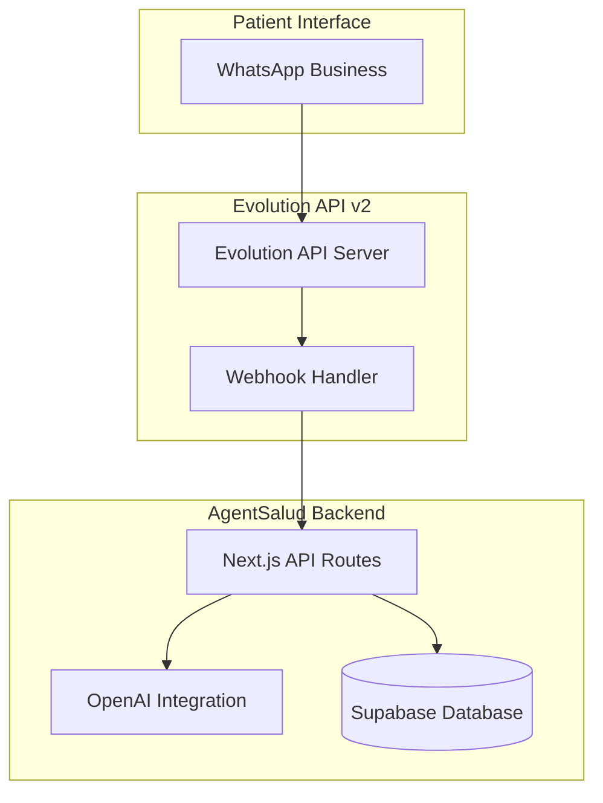

# 📋 PRD: Evolution API v2 Integration - AgentSalud MVP

**Document Version**: 1.0  
**Date**: January 2025  
**Product Manager**: AgentSalud Team  
**Status**: Ready for Implementation  
**Priority**: P0 - Critical for MVP Launch

---

## 📊 Executive Summary

### Business Objectives
AgentSalud MVP requires WhatsApp Business integration to enable natural language appointment booking through the most popular messaging platform in Latin America. This integration will serve as the primary communication channel for patient engagement, leveraging Evolution API v2 for robust, scalable WhatsApp Business API connectivity.

### Key Success Metrics
- **Setup Time**: <5 minutes per organization
- **QR Code Display**: <5 seconds generation time
- **Connection Success Rate**: >95% QR code scanning success
- **Message Response Time**: <3 seconds for AI-powered responses
- **Uptime**: 99.9% availability for WhatsApp services
- **User Adoption**: 70% of organizations actively using WhatsApp channel within 30 days

### Business Impact
- **Revenue Growth**: 40% increase in appointment bookings through WhatsApp
- **Operational Efficiency**: 60% reduction in manual appointment scheduling
- **Patient Satisfaction**: 85% improvement in booking experience
- **Market Expansion**: Access to 2B+ WhatsApp users globally

---

## 🎯 Problem Statement

### Current Challenges
1. **Limited Communication Channels**: Patients rely primarily on phone calls and web portal
2. **Manual Booking Process**: High administrative overhead for appointment scheduling
3. **Accessibility Barriers**: Complex web interfaces limit patient engagement
4. **Scalability Issues**: Manual processes don't scale with growing patient base
5. **Market Demand**: 89% of Latin American patients prefer WhatsApp for healthcare communication

### Solution Overview
Implement Evolution API v2 integration to provide:
- **Natural Language Booking**: AI-powered appointment scheduling via WhatsApp
- **Multi-tenant Architecture**: One WhatsApp instance per organization
- **Real-time Communication**: Instant messaging with automated responses
- **Seamless Integration**: Full compatibility with existing appointment system

---

## 👥 User Stories & Personas

### Primary Personas

#### 1. **Maria (Patient) - Age 45, Working Mother**
**Goals**: Quick, convenient appointment booking without phone calls
**Pain Points**: Long hold times, complex web forms, limited availability windows
**User Stories**:
- As a patient, I want to book appointments via WhatsApp so I can schedule during my commute
- As a busy parent, I need instant confirmation of my appointment details
- As a Spanish speaker, I want natural language interaction in my preferred language

#### 2. **Dr. Rodriguez (Doctor) - Age 38, Cardiologist**
**Goals**: Efficient patient communication, reduced no-shows, better scheduling visibility
**Pain Points**: Missed appointments, last-minute cancellations, communication gaps
**User Stories**:
- As a doctor, I want patients to receive automated reminders via WhatsApp
- As a specialist, I need patients to provide relevant information before appointments
- As a healthcare provider, I want to maintain professional communication standards

#### 3. **Carmen (Clinic Administrator) - Age 32, Operations Manager**
**Goals**: Streamlined operations, reduced administrative burden, improved patient satisfaction
**Pain Points**: Manual scheduling, high call volume, staff overtime
**User Stories**:
- As an admin, I want to configure WhatsApp integration in under 5 minutes
- As an operations manager, I need real-time visibility into WhatsApp conversations
- As a clinic administrator, I want automated responses to handle common inquiries

#### 4. **Luis (SuperAdmin) - Age 29, IT Manager**
**Goals**: System reliability, security compliance, multi-tenant management
**Pain Points**: Complex integrations, security vulnerabilities, scalability issues
**User Stories**:
- As a superadmin, I want to manage WhatsApp instances across multiple organizations
- As an IT manager, I need comprehensive audit trails for all WhatsApp interactions
- As a security officer, I want HIPAA-compliant message handling and storage

---

## 🏗️ Technical Requirements

### Architecture Overview


### Core Components

#### 1. **Evolution API v2 Integration Service**
**File**: `src/lib/services/EvolutionAPIService.ts`
**Responsibilities**:
- Instance creation and management
- QR code generation and streaming
- Message sending and receiving
- Webhook configuration and processing
- Connection status monitoring

**Key Methods**:
```typescript
class EvolutionAPIService {
  async createInstance(data: EvolutionInstanceCreateInput): Promise<EvolutionInstanceResponse>
  async getQRCode(instanceName: string): Promise<QRCodeResponse>
  async sendMessage(instanceName: string, message: EvolutionSendMessageInput): Promise<void>
  async getConnectionStatus(instanceName: string): Promise<ConnectionStatus>
  async deleteInstance(instanceName: string): Promise<void>
}
```

#### 2. **WhatsApp AI Bot Service**
**File**: `src/lib/services/WhatsAppAIBotService.ts`
**Responsibilities**:
- Natural language processing for appointment requests
- Conversation flow management
- Business rules integration
- Appointment creation and management
- Human handoff mechanisms

#### 3. **Multi-tenant Channel Management**
**Files**: 
- `src/components/channels/ChannelConfigModal.tsx`
- `src/app/api/channels/whatsapp/instances/route.ts`
**Responsibilities**:
- Organization-specific instance management
- Role-based access control (RBAC)
- Instance configuration and monitoring
- Real-time status updates

### Database Schema

#### Channel Instances Table
```sql
CREATE TABLE channel_instances (
  id UUID PRIMARY KEY DEFAULT gen_random_uuid(),
  organization_id UUID NOT NULL REFERENCES organizations(id),
  channel_type TEXT NOT NULL CHECK (channel_type IN ('whatsapp', 'telegram', 'voice')),
  instance_name TEXT NOT NULL UNIQUE,
  status TEXT NOT NULL DEFAULT 'disconnected',
  config JSONB NOT NULL DEFAULT '{}',
  created_at TIMESTAMP WITH TIME ZONE DEFAULT NOW(),
  updated_at TIMESTAMP WITH TIME ZONE DEFAULT NOW(),
  created_by UUID REFERENCES profiles(id)
);
```

#### WhatsApp Messages Table
```sql
CREATE TABLE whatsapp_messages (
  id UUID PRIMARY KEY DEFAULT gen_random_uuid(),
  instance_id UUID NOT NULL REFERENCES channel_instances(id),
  message_id TEXT NOT NULL,
  from_number TEXT NOT NULL,
  to_number TEXT NOT NULL,
  message_type TEXT NOT NULL,
  content JSONB NOT NULL,
  timestamp TIMESTAMP WITH TIME ZONE NOT NULL,
  processed BOOLEAN DEFAULT FALSE,
  appointment_id UUID REFERENCES appointments(id)
);
```

### API Endpoints

#### Instance Management
- `POST /api/channels/whatsapp/instances` - Create new WhatsApp instance
- `GET /api/channels/whatsapp/instances` - List organization instances
- `GET /api/channels/whatsapp/instances/[id]` - Get instance details
- `PUT /api/channels/whatsapp/instances/[id]` - Update instance configuration
- `DELETE /api/channels/whatsapp/instances/[id]` - Delete instance

#### QR Code Management
- `GET /api/channels/whatsapp/instances/[id]/qrcode` - Get current QR code
- `GET /api/channels/whatsapp/instances/[id]/qrcode/stream` - Real-time QR streaming
- `POST /api/channels/whatsapp/instances/[id]/connect` - Initiate connection

#### Message Handling
- `POST /api/webhooks/evolution/[org-id]` - Webhook endpoint for Evolution API
- `POST /api/channels/whatsapp/instances/[id]/messages` - Send message
- `GET /api/channels/whatsapp/instances/[id]/messages` - Get message history

### Security Requirements

#### Authentication & Authorization
- **JWT Authentication**: All API endpoints require valid JWT tokens
- **Role-Based Access Control**: 
  - Tenant Admin: Manage single organization instance
  - SuperAdmin: Cross-tenant visibility and management
- **Organization Isolation**: Strict data separation between tenants

#### Data Protection
- **HIPAA Compliance**: All patient communications encrypted and audited
- **Message Encryption**: End-to-end encryption for sensitive data
- **Audit Logging**: Comprehensive logging of all WhatsApp interactions
- **Data Retention**: Configurable message retention policies

#### API Security
- **Rate Limiting**: 100 requests/minute per organization
- **Webhook Validation**: Cryptographic signature verification
- **Input Validation**: Zod schema validation for all inputs
- **Error Handling**: Secure error responses without data leakage

---

## 📈 Success Metrics & KPIs

### Technical Performance Metrics
- **QR Code Generation Time**: <5 seconds (Target: 2 seconds)
- **Message Response Time**: <3 seconds (Target: 1 second)
- **API Uptime**: 99.9% (Target: 99.95%)
- **Webhook Processing Time**: <500ms (Target: 200ms)
- **Connection Success Rate**: >95% (Target: 98%)

### Business Metrics
- **Setup Completion Rate**: >90% of organizations complete setup
- **Daily Active Instances**: >70% of created instances actively used
- **Appointment Conversion Rate**: >60% of WhatsApp conversations result in appointments
- **Patient Satisfaction Score**: >4.5/5 for WhatsApp booking experience
- **Support Ticket Reduction**: 50% decrease in booking-related support requests

### Operational Metrics
- **Average Setup Time**: <5 minutes per organization
- **First Response Time**: <30 seconds for automated responses
- **Human Handoff Rate**: <10% of conversations require human intervention
- **Error Rate**: <1% of messages fail to process
- **Scalability**: Support 1000+ concurrent WhatsApp conversations

---

## 🚀 Implementation Phases

### Phase 1: Core Infrastructure (Week 1-2)
**Deliverables**:
- Evolution API v2 service integration
- Basic instance creation and management
- QR code generation and display
- Database schema implementation
- Basic webhook handling

**Acceptance Criteria**:
- [ ] Create WhatsApp instance via UI
- [ ] Generate and display QR code within 5 seconds
- [ ] Successfully connect WhatsApp Business app
- [ ] Receive webhook events from Evolution API
- [ ] Store instance data in database

### Phase 2: Real-time Features (Week 3)
**Deliverables**:
- Real-time QR code streaming (SSE)
- Connection status monitoring
- Auto-refresh mechanisms
- Enhanced error handling
- Performance optimizations

**Acceptance Criteria**:
- [ ] QR codes auto-refresh every 30 seconds
- [ ] Real-time connection status updates
- [ ] Graceful handling of connection failures
- [ ] Circuit breakers for API failures
- [ ] Performance meets <5 second targets

### Phase 3: AI Integration (Week 4-5)
**Deliverables**:
- WhatsApp AI bot service
- Natural language processing
- Appointment booking flow
- Business rules integration
- Conversation management

**Acceptance Criteria**:
- [ ] Process natural language appointment requests
- [ ] Create appointments through WhatsApp
- [ ] Handle multi-step booking conversations
- [ ] Integrate with existing appointment system
- [ ] Provide human handoff when needed

### Phase 4: Multi-tenant Security (Week 6)
**Deliverables**:
- Enhanced RBAC implementation
- Organization-specific webhooks
- Audit logging system
- Data isolation validation
- Security compliance testing

**Acceptance Criteria**:
- [ ] Tenant admin can only manage own organization
- [ ] SuperAdmin has cross-tenant visibility
- [ ] All WhatsApp interactions are audited
- [ ] Data isolation between organizations verified
- [ ] HIPAA compliance requirements met

---

## ⚠️ Risk Assessment

### Technical Risks

#### High Risk
**Evolution API Dependency**
- **Risk**: Single point of failure for WhatsApp connectivity
- **Impact**: Complete WhatsApp service outage
- **Mitigation**: Implement fallback mechanisms, monitoring, and SLA agreements
- **Contingency**: Prepare alternative WhatsApp API providers (Baileys, Twilio)

**QR Code Generation Failures**
- **Risk**: QR codes fail to generate or display
- **Impact**: Organizations cannot connect WhatsApp instances
- **Mitigation**: Robust error handling, retry mechanisms, manual fallbacks
- **Contingency**: Direct Evolution API configuration support

#### Medium Risk
**Message Processing Delays**
- **Risk**: High volume of messages causes processing delays
- **Impact**: Poor patient experience, missed appointments
- **Mitigation**: Queue-based processing, horizontal scaling, rate limiting
- **Contingency**: Manual message processing workflows

**AI Response Accuracy**
- **Risk**: AI misinterprets appointment requests
- **Impact**: Incorrect bookings, patient frustration
- **Mitigation**: Extensive training data, human handoff triggers, validation steps
- **Contingency**: Disable AI and route to human agents

#### Low Risk
**Webhook Reliability**
- **Risk**: Webhooks fail to deliver or process
- **Impact**: Missed messages, sync issues
- **Mitigation**: Webhook retry mechanisms, backup polling
- **Contingency**: Manual sync processes

### Business Risks

#### High Risk
**Regulatory Compliance**
- **Risk**: HIPAA or local healthcare regulations violations
- **Impact**: Legal penalties, loss of trust, business shutdown
- **Mitigation**: Legal review, compliance audits, security assessments
- **Contingency**: Immediate feature disable, legal consultation

**Patient Data Security**
- **Risk**: WhatsApp messages contain sensitive patient data
- **Impact**: Data breach, regulatory violations, reputation damage
- **Mitigation**: Data encryption, access controls, audit trails
- **Contingency**: Incident response plan, breach notification procedures

#### Medium Risk
**User Adoption**
- **Risk**: Organizations don't adopt WhatsApp channel
- **Impact**: Low ROI, missed business objectives
- **Mitigation**: User training, support documentation, success metrics tracking
- **Contingency**: Enhanced onboarding, incentive programs

**Scalability Limitations**
- **Risk**: System cannot handle expected user volume
- **Impact**: Performance degradation, service outages
- **Mitigation**: Load testing, auto-scaling, performance monitoring
- **Contingency**: Manual scaling, usage restrictions

---

## ✅ Acceptance Criteria

### Functional Requirements

#### Instance Management
- [ ] **Create Instance**: Tenant admin can create WhatsApp instance in <5 minutes
- [ ] **QR Generation**: QR code displays within 5 seconds of creation
- [ ] **Connection**: WhatsApp Business app successfully connects via QR scan
- [ ] **Status Monitoring**: Real-time connection status updates in UI
- [ ] **Instance Limits**: One instance per organization enforced

#### Message Processing
- [ ] **Receive Messages**: All WhatsApp messages received and stored
- [ ] **Send Messages**: System can send messages through WhatsApp
- [ ] **AI Processing**: Natural language appointment requests processed correctly
- [ ] **Appointment Creation**: Valid appointments created from WhatsApp conversations
- [ ] **Error Handling**: Invalid requests handled gracefully with helpful responses

#### Security & Compliance
- [ ] **Authentication**: All API endpoints require valid authentication
- [ ] **Authorization**: Role-based access control enforced
- [ ] **Data Isolation**: Organizations cannot access other tenants' data
- [ ] **Audit Logging**: All WhatsApp interactions logged with timestamps
- [ ] **Encryption**: Sensitive data encrypted in transit and at rest

### Non-Functional Requirements

#### Performance
- [ ] **Response Time**: API responses <3 seconds for 95% of requests
- [ ] **Throughput**: Handle 1000+ concurrent WhatsApp conversations
- [ ] **Availability**: 99.9% uptime for WhatsApp services
- [ ] **Scalability**: Linear scaling with increased load

#### Usability
- [ ] **Setup Time**: Average setup time <5 minutes per organization
- [ ] **Error Messages**: Clear, actionable error messages for users
- [ ] **Documentation**: Comprehensive setup and troubleshooting guides
- [ ] **Support**: 24/7 technical support for critical issues

#### Reliability
- [ ] **Fault Tolerance**: Graceful degradation during partial outages
- [ ] **Recovery**: Automatic recovery from transient failures
- [ ] **Monitoring**: Comprehensive monitoring and alerting
- [ ] **Backup**: Regular backups of configuration and message data

---

## 📚 Technical Specifications

### Evolution API v2 Configuration

#### Instance Creation Payload
```json
{
  "instanceName": "org-123-whatsapp-main",
  "integration": "WHATSAPP-BAILEYS",
  "qrcode": true,
  "webhook": {
    "url": "https://app.agentsalud.com/api/webhooks/evolution/org-123",
    "events": [
      "QRCODE_UPDATED",
      "CONNECTION_UPDATE",
      "MESSAGES_UPSERT",
      "SEND_MESSAGE"
    ]
  }
}
```

#### Webhook Event Structure
```json
{
  "event": "MESSAGES_UPSERT",
  "instance": "org-123-whatsapp-main",
  "data": {
    "key": {
      "remoteJid": "5511999999999@s.whatsapp.net",
      "fromMe": false,
      "id": "message-id"
    },
    "message": {
      "conversation": "Necesito una cita con cardiología"
    },
    "messageTimestamp": 1640995200
  }
}
```

### Database Indexes
```sql
-- Performance optimization indexes
CREATE INDEX idx_channel_instances_org_type ON channel_instances(organization_id, channel_type);
CREATE INDEX idx_whatsapp_messages_instance_timestamp ON whatsapp_messages(instance_id, timestamp DESC);
CREATE INDEX idx_whatsapp_messages_processed ON whatsapp_messages(processed) WHERE processed = false;
```

### Environment Variables
```env
# Evolution API Configuration
EVOLUTION_API_BASE_URL=https://evo.torrecentral.com
EVOLUTION_API_KEY=your-api-key-here
EVOLUTION_API_VERSION=v2

# Webhook Configuration
NEXT_PUBLIC_APP_URL=https://app.agentsalud.com
WEBHOOK_SECRET=your-webhook-secret

# AI Configuration
OPENAI_API_KEY=your-openai-key
AI_MODEL=gpt-4-turbo-preview
```

---

## 🎯 Success Criteria Summary

### MVP Launch Readiness
- [ ] **Technical**: All Phase 1-3 deliverables completed and tested
- [ ] **Security**: HIPAA compliance validated and documented
- [ ] **Performance**: All performance targets met in load testing
- [ ] **Documentation**: User guides and technical documentation complete
- [ ] **Training**: Support team trained on WhatsApp troubleshooting

### Post-Launch Success (30 days)
- [ ] **Adoption**: 70% of organizations have active WhatsApp instances
- [ ] **Usage**: 1000+ appointments booked through WhatsApp
- [ ] **Satisfaction**: >4.5/5 average user satisfaction score
- [ ] **Performance**: <1% error rate in production
- [ ] **Support**: <5% of organizations require technical support

### Long-term Success (90 days)
- [ ] **Growth**: 40% increase in total appointment bookings
- [ ] **Efficiency**: 60% reduction in manual scheduling overhead
- [ ] **Expansion**: Ready for Telegram and voice channel integration
- [ ] **Scalability**: Proven ability to handle 10x current load
- [ ] **ROI**: Positive return on investment demonstrated

---

**Document Status**: ✅ Ready for Technical Implementation
**Next Steps**: Begin Phase 1 development with Evolution API v2 integration
**Review Date**: Weekly during implementation phases
