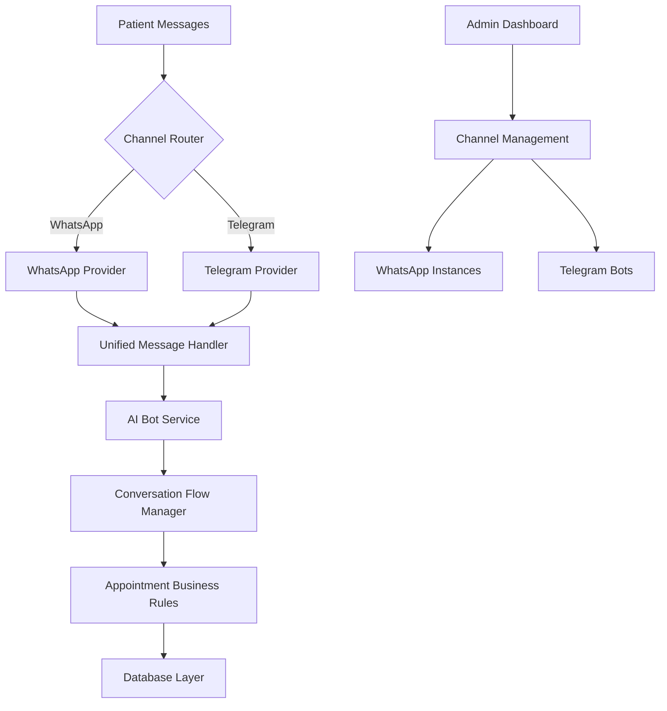

# Telegram Channel Integration Roadmap

## Executive Summary

This roadmap outlines the comprehensive integration of Telegram as a secondary communication channel for the AgentSalud platform, leveraging our existing WhatsApp infrastructure and extending it to support Telegram's unique features and capabilities.

## 1. Integration Overview

### 1.1 Strategic Objectives
- **Channel Diversification**: Reduce dependency on single communication platform
- **User Choice**: Provide patients with preferred communication method
- **Feature Enhancement**: Leverage Telegram's rich interaction capabilities
- **Market Expansion**: Reach tech-savvy patient demographics

### 1.2 Architecture Approach
- **Unified Backend**: Extend existing multi-tenant architecture
- **Channel Abstraction**: Implement platform-agnostic messaging layer
- **Shared Services**: Reuse AI bot, appointment, and notification systems
- **Incremental Deployment**: Gradual rollout with minimal disruption

## 2. Technical Architecture

### 2.1 Multi-Channel Architecture Design



### 2.2 Channel Provider Interface

```typescript
interface ChannelProvider {
  // Core messaging
  sendMessage(recipient: string, message: string, options?: MessageOptions): Promise<MessageResult>;
  sendTemplate(recipient: string, template: MessageTemplate): Promise<MessageResult>;
  sendMedia(recipient: string, media: MediaContent): Promise<MessageResult>;
  
  // Interactive features
  sendInlineKeyboard(recipient: string, message: string, keyboard: InlineKeyboard): Promise<MessageResult>;
  sendCustomKeyboard(recipient: string, message: string, keyboard: CustomKeyboard): Promise<MessageResult>;
  
  // Instance management
  createInstance(config: ChannelConfig): Promise<InstanceResult>;
  validateInstance(instanceId: string): Promise<ValidationResult>;
  getInstanceStatus(instanceId: string): Promise<StatusResult>;
  
  // Webhook handling
  handleWebhook(payload: any): Promise<WebhookResult>;
  verifyWebhook(signature: string, payload: string): boolean;
}
```

### 2.3 Telegram-Specific Implementation

```typescript
class TelegramProvider implements ChannelProvider {
  private botToken: string;
  private webhookUrl: string;
  private apiUrl = 'https://api.telegram.org/bot';

  async sendMessage(
    chatId: string, 
    message: string, 
    options?: TelegramMessageOptions
  ): Promise<MessageResult> {
    const payload = {
      chat_id: chatId,
      text: message,
      parse_mode: options?.parseMode || 'HTML',
      reply_markup: options?.replyMarkup
    };

    const response = await fetch(`${this.apiUrl}${this.botToken}/sendMessage`, {
      method: 'POST',
      headers: { 'Content-Type': 'application/json' },
      body: JSON.stringify(payload)
    });

    return this.handleResponse(response);
  }

  async sendInlineKeyboard(
    chatId: string,
    message: string,
    keyboard: TelegramInlineKeyboard
  ): Promise<MessageResult> {
    return this.sendMessage(chatId, message, {
      replyMarkup: {
        inline_keyboard: keyboard.buttons
      }
    });
  }

  async handleWebhook(payload: TelegramUpdate): Promise<WebhookResult> {
    if (payload.message) {
      return this.handleMessage(payload.message);
    } else if (payload.callback_query) {
      return this.handleCallbackQuery(payload.callback_query);
    }
    
    return { success: true, message: 'Update processed' };
  }
}
```

## 3. Implementation Phases

### 3.1 Phase 1: Core Telegram Integration (Weeks 1-6)

#### 3.1.1 Week 1-2: Foundation Setup
**Deliverables:**
- Telegram Bot API integration
- Basic webhook handling
- Database schema extensions
- Channel provider interface implementation

```sql
-- Database schema additions
CREATE TABLE telegram_instances (
    id UUID PRIMARY KEY DEFAULT gen_random_uuid(),
    organization_id UUID REFERENCES organizations(id) NOT NULL,
    bot_token VARCHAR(255) NOT NULL,
    bot_username VARCHAR(255) NOT NULL,
    webhook_url TEXT,
    status VARCHAR(50) DEFAULT 'inactive',
    config JSONB DEFAULT '{}',
    created_at TIMESTAMP WITH TIME ZONE DEFAULT NOW(),
    updated_at TIMESTAMP WITH TIME ZONE DEFAULT NOW()
);

CREATE TABLE telegram_notifications (
    id UUID PRIMARY KEY DEFAULT gen_random_uuid(),
    appointment_id UUID REFERENCES appointments(id) NOT NULL,
    telegram_instance_id UUID REFERENCES telegram_instances(id) NOT NULL,
    chat_id VARCHAR(255) NOT NULL,
    message_id INTEGER,
    notification_type VARCHAR(100) NOT NULL,
    status VARCHAR(50) DEFAULT 'pending',
    sent_at TIMESTAMP WITH TIME ZONE,
    delivered_at TIMESTAMP WITH TIME ZONE,
    error_message TEXT,
    created_at TIMESTAMP WITH TIME ZONE DEFAULT NOW()
);
```

#### 3.1.2 Week 3-4: Message Handling & Conversation Flow
**Deliverables:**
- Telegram message processing
- Conversation flow adaptation
- Command handling system
- Basic appointment booking flow

```typescript
class TelegramConversationHandler {
  async handleMessage(message: TelegramMessage): Promise<void> {
    const chatId = message.chat.id.toString();
    const text = message.text || '';
    
    // Handle bot commands
    if (text.startsWith('/')) {
      await this.handleCommand(chatId, text);
      return;
    }
    
    // Process through unified conversation flow
    const result = await this.conversationManager.processMessage(
      'telegram',
      chatId,
      text,
      message
    );
    
    if (result.response) {
      await this.sendResponse(chatId, result.response);
    }
  }

  async handleCommand(chatId: string, command: string): Promise<void> {
    const [cmd, ...args] = command.split(' ');
    
    switch (cmd) {
      case '/start':
        await this.handleStartCommand(chatId);
        break;
      case '/book':
        await this.handleBookCommand(chatId);
        break;
      case '/help':
        await this.handleHelpCommand(chatId);
        break;
      case '/status':
        await this.handleStatusCommand(chatId);
        break;
      default:
        await this.handleUnknownCommand(chatId, cmd);
    }
  }
}
```

#### 3.1.3 Week 5-6: Inline Keyboards & Interactive Features
**Deliverables:**
- Inline keyboard implementation
- Callback query handling
- Interactive appointment booking
- Service selection interface

```typescript
class TelegramInteractiveBooking {
  async showServiceSelection(chatId: string): Promise<void> {
    const keyboard = {
      inline_keyboard: [
        [
          { text: "👁️ Examen Visual Completo", callback_data: "service_exam_complete" },
          { text: "🔬 Terapia Visual", callback_data: "service_therapy" }
        ],
        [
          { text: "👓 Adaptación Lentes", callback_data: "service_contacts" },
          { text: "⚡ Control Rápido", callback_data: "service_quick" }
        ],
        [
          { text: "❓ Más información", callback_data: "service_info" }
        ]
      ]
    };

    await this.telegramProvider.sendMessage(
      chatId,
      "🏥 <b>Selecciona el tipo de servicio:</b>\n\n" +
      "Elige el servicio que necesitas para tu cita de optometría.",
      { 
        parseMode: 'HTML',
        replyMarkup: keyboard 
      }
    );
  }

  async handleServiceSelection(callbackQuery: TelegramCallbackQuery): Promise<void> {
    const chatId = callbackQuery.message.chat.id.toString();
    const serviceType = callbackQuery.data.replace('service_', '');
    
    // Update conversation flow
    await this.conversationManager.updateFlowData(chatId, {
      selectedService: serviceType
    });
    
    // Show next step (date selection)
    await this.showDateSelection(chatId, serviceType);
    
    // Answer callback query
    await this.telegramProvider.answerCallbackQuery(
      callbackQuery.id,
      "✅ Servicio seleccionado"
    );
  }
}
```

### 3.2 Phase 2: Advanced Features (Weeks 7-10)

#### 3.2.1 Week 7-8: File Handling & Document Support
**Deliverables:**
- Document upload handling
- Medical file processing
- Image and PDF support
- File validation and storage

```typescript
class TelegramFileHandler {
  async handleDocument(message: TelegramMessage): Promise<void> {
    const document = message.document;
    const chatId = message.chat.id.toString();
    
    // Validate file type and size
    if (!this.isValidMedicalDocument(document)) {
      await this.sendInvalidFileMessage(chatId);
      return;
    }
    
    // Download and process file
    const fileUrl = await this.getFileUrl(document.file_id);
    const fileBuffer = await this.downloadFile(fileUrl);
    
    // Store in secure storage
    const fileId = await this.storeSecureFile(fileBuffer, {
      originalName: document.file_name,
      mimeType: document.mime_type,
      chatId,
      uploadedAt: new Date()
    });
    
    // Update conversation context
    await this.conversationManager.addFileToContext(chatId, {
      fileId,
      type: this.getDocumentType(document.file_name),
      description: 'Patient uploaded document'
    });
    
    await this.sendFileConfirmation(chatId, document.file_name);
  }

  private isValidMedicalDocument(document: TelegramDocument): boolean {
    const allowedTypes = [
      'application/pdf',
      'image/jpeg',
      'image/png',
      'image/jpg'
    ];
    
    const maxSize = 10 * 1024 * 1024; // 10MB
    
    return allowedTypes.includes(document.mime_type) && 
           document.file_size <= maxSize;
  }
}
```

#### 3.2.2 Week 9-10: Web App Integration
**Deliverables:**
- Telegram Web App setup
- Complex form handling
- Calendar integration
- Advanced appointment booking

```typescript
class TelegramWebApp {
  async showAdvancedBooking(chatId: string): Promise<void> {
    const webAppUrl = `${process.env.NEXT_PUBLIC_APP_URL}/telegram-webapp/booking`;
    
    const keyboard = {
      inline_keyboard: [[
        {
          text: "📅 Agendar Cita Avanzada",
          web_app: { url: webAppUrl }
        }
      ]]
    };

    await this.telegramProvider.sendMessage(
      chatId,
      "🚀 <b>Booking Avanzado</b>\n\n" +
      "Para una experiencia más completa, usa nuestra interfaz web:",
      {
        parseMode: 'HTML',
        replyMarkup: keyboard
      }
    );
  }

  async handleWebAppData(data: TelegramWebAppData): Promise<void> {
    const appointmentData = JSON.parse(data.data);
    
    // Validate and process appointment
    const result = await this.appointmentService.createAppointment({
      ...appointmentData,
      source: 'telegram_webapp',
      chatId: data.chat_id
    });
    
    if (result.success) {
      await this.sendAppointmentConfirmation(
        data.chat_id,
        result.appointment
      );
    } else {
      await this.sendBookingError(data.chat_id, result.error);
    }
  }
}
```

### 3.3 Phase 3: Multi-Channel Unification (Weeks 11-13)

#### 3.3.1 Week 11-12: Unified Channel Management
**Deliverables:**
- Channel-agnostic admin interface
- Cross-channel analytics
- Unified notification system
- Channel preference management

```typescript
class UnifiedChannelManager {
  async createChannelInstance(
    organizationId: string,
    channelType: 'whatsapp' | 'telegram',
    config: ChannelConfig
  ): Promise<ChannelInstance> {
    const provider = this.getProvider(channelType);
    
    // Create instance through provider
    const instance = await provider.createInstance(config);
    
    // Store in unified database
    const channelInstance = await this.database.channelInstances.create({
      organizationId,
      channelType,
      instanceId: instance.id,
      config: instance.config,
      status: 'active'
    });
    
    // Setup webhooks
    await this.setupWebhooks(channelInstance);
    
    return channelInstance;
  }

  async sendUnifiedNotification(
    notification: UnifiedNotification
  ): Promise<NotificationResult[]> {
    const results: NotificationResult[] = [];
    
    for (const channel of notification.channels) {
      const provider = this.getProvider(channel.type);
      
      try {
        const result = await provider.sendMessage(
          channel.recipient,
          notification.message,
          channel.options
        );
        
        results.push({
          channel: channel.type,
          success: true,
          messageId: result.messageId
        });
      } catch (error) {
        results.push({
          channel: channel.type,
          success: false,
          error: error.message
        });
      }
    }
    
    return results;
  }
}
```

#### 3.3.2 Week 13: Testing & Optimization
**Deliverables:**
- End-to-end testing
- Performance optimization
- Load testing
- Documentation completion

```typescript
class TelegramIntegrationTests {
  async runE2ETests(): Promise<TestResults> {
    const tests = [
      this.testBasicMessaging(),
      this.testAppointmentBooking(),
      this.testInlineKeyboards(),
      this.testFileUploads(),
      this.testWebAppIntegration(),
      this.testMultiChannelSync(),
      this.testErrorHandling(),
      this.testSecurityValidation()
    ];
    
    const results = await Promise.allSettled(tests);
    
    return this.compileTestResults(results);
  }

  async testAppointmentBooking(): Promise<TestResult> {
    // Simulate complete appointment booking flow
    const chatId = 'test_chat_123';
    
    // Start booking
    await this.simulateCommand(chatId, '/book');
    
    // Select service
    await this.simulateCallback(chatId, 'service_exam_complete');
    
    // Select date
    await this.simulateCallback(chatId, 'date_2024-02-15');
    
    // Select time
    await this.simulateCallback(chatId, 'time_10:00');
    
    // Confirm booking
    await this.simulateCallback(chatId, 'confirm_booking');
    
    // Verify appointment created
    const appointment = await this.getLastAppointment(chatId);
    
    return {
      test: 'appointment_booking',
      success: !!appointment,
      duration: Date.now() - this.startTime,
      details: appointment
    };
  }
}
```

## 4. User Experience Design

### 4.1 Telegram-Optimized Booking Flow

```
Patient: /book
Bot: 🏥 ¡Hola! Te ayudo a agendar tu cita de optometría.

[Inline Keyboard]
👁️ Examen Visual Completo    🔬 Terapia Visual
👓 Adaptación Lentes         ⚡ Control Rápido
❓ Más información

Patient: [Clicks "Examen Visual Completo"]
Bot: ✅ Examen Visual Completo seleccionado.
     📅 ¿Qué día prefieres para tu cita?

[Inline Keyboard]
📅 Hoy        📅 Mañana      📅 Esta semana
📅 Próxima semana           📅 Elegir fecha específica

Patient: [Clicks "Mañana"]
Bot: 📅 Perfecto, mañana 15 de febrero.
     🕐 ¿A qué hora te conviene?

[Inline Keyboard]
🕘 9:00 AM    🕙 10:00 AM    🕚 11:00 AM
🕐 1:00 PM    🕑 2:00 PM     🕒 3:00 PM
🕓 4:00 PM    🕔 5:00 PM

Patient: [Clicks "10:00 AM"]
Bot: 🕙 10:00 AM seleccionado.
     👨‍⚕️ ¿Tienes preferencia por algún doctor?

[Inline Keyboard]
👨‍⚕️ Dr. Elena López        👩‍⚕️ Dr. Ana Rodríguez
👨‍⚕️ Dr. Pedro Sánchez      ✨ Cualquier doctor disponible

Patient: [Clicks "Cualquier doctor disponible"]
Bot: 📋 **Confirma los detalles de tu cita:**

🏥 **Servicio:** Examen Visual Completo
📅 **Fecha:** Mañana, 15 de febrero de 2024
🕙 **Hora:** 10:00 AM
👨‍⚕️ **Doctor:** Cualquier doctor disponible
📍 **Ubicación:** VisualCare Norte

[Inline Keyboard]
✅ Confirmar Cita    ✏️ Modificar    ❌ Cancelar

Patient: [Clicks "Confirmar Cita"]
Bot: 🎉 **¡Cita agendada exitosamente!**

📋 **Detalles confirmados:**
• **Servicio:** Examen Visual Completo
• **Fecha:** 15 de febrero de 2024
• **Hora:** 10:00 AM
• **Doctor:** Dr. Ana Rodríguez
• **Ubicación:** VisualCare Norte

📱 **Número de confirmación:** #APT-1738095847291

🔔 Te enviaré un recordatorio 24 horas antes.
📞 Si necesitas cambios, usa /reschedule o /cancel

[Inline Keyboard]
📅 Agendar otra cita    📞 Contactar soporte    🏠 Menú principal
```

### 4.2 Command System

```typescript
const telegramCommands = [
  {
    command: 'start',
    description: 'Iniciar conversación con el bot',
    handler: 'handleStartCommand'
  },
  {
    command: 'book',
    description: 'Agendar nueva cita médica',
    handler: 'handleBookCommand'
  },
  {
    command: 'reschedule',
    description: 'Reagendar cita existente',
    handler: 'handleRescheduleCommand'
  },
  {
    command: 'cancel',
    description: 'Cancelar cita programada',
    handler: 'handleCancelCommand'
  },
  {
    command: 'status',
    description: 'Ver estado de mis citas',
    handler: 'handleStatusCommand'
  },
  {
    command: 'help',
    description: 'Obtener ayuda y soporte',
    handler: 'handleHelpCommand'
  },
  {
    command: 'settings',
    description: 'Configurar preferencias',
    handler: 'handleSettingsCommand'
  }
];
```

## 5. Integration Benefits

### 5.1 Technical Advantages
- **Rich Interactions**: Inline keyboards, custom keyboards, web apps
- **File Handling**: Support for documents, images, videos up to 2GB
- **Bot Commands**: Native command system for quick actions
- **No Rate Limits**: Generous API limits for bot messaging
- **Real-time Updates**: Instant message delivery and status updates

### 5.2 User Experience Benefits
- **Familiar Interface**: Users comfortable with Telegram's UI
- **Advanced Features**: Web apps for complex interactions
- **File Sharing**: Easy document upload for medical records
- **Quick Actions**: Command-based shortcuts for common tasks
- **Rich Media**: Support for images, videos, and documents

### 5.3 Business Value
- **Channel Diversification**: Reduced dependency on single platform
- **User Preference**: Choice of communication method
- **Tech-Savvy Audience**: Appeal to younger, tech-oriented patients
- **Feature Differentiation**: Advanced capabilities not available in WhatsApp

## 6. Success Metrics

### 6.1 Technical KPIs
```typescript
interface TelegramKPIs {
  messageDeliveryRate: number; // Target: > 99%
  averageResponseTime: number; // Target: < 500ms
  webhookReliability: number; // Target: > 99.5%
  commandSuccessRate: number; // Target: > 95%
  fileUploadSuccessRate: number; // Target: > 98%
}
```

### 6.2 User Engagement KPIs
```typescript
interface EngagementKPIs {
  appointmentBookingCompletionRate: number; // Target: > 80%
  userRetentionRate: number; // Target: > 70%
  averageSessionDuration: number; // Target: 3-5 minutes
  commandUsageFrequency: number; // Target: 2-3 commands per session
  userSatisfactionScore: number; // Target: > 4.5/5
}
```

## 7. Risk Assessment

### 7.1 Technical Risks
| Risk | Probability | Impact | Mitigation |
|------|-------------|--------|------------|
| **API Changes** | Low | Medium | Use stable Bot API endpoints, monitor updates |
| **Webhook Reliability** | Low | High | Implement retry logic and monitoring |
| **File Upload Issues** | Medium | Low | Comprehensive validation and error handling |
| **Performance Degradation** | Low | Medium | Load testing and optimization |

### 7.2 Business Risks
| Risk | Probability | Impact | Mitigation |
|------|-------------|--------|------------|
| **Low User Adoption** | Medium | Medium | Gradual rollout with user education |
| **Channel Fragmentation** | Medium | High | Unified admin interface and training |
| **Support Complexity** | High | Medium | Comprehensive documentation and training |
| **Feature Parity Issues** | Low | Medium | Clear feature mapping and communication |

## 8. Timeline & Resource Requirements

### 8.1 Development Timeline
| Phase | Duration | Developers | Key Deliverables |
|-------|----------|------------|------------------|
| **Phase 1** | 6 weeks | 2-3 | Core integration, basic booking |
| **Phase 2** | 4 weeks | 2 | Advanced features, file handling |
| **Phase 3** | 3 weeks | 2-3 | Multi-channel unification |
| **Total** | **13 weeks** | **2-3** | Complete Telegram integration |

### 8.2 Resource Allocation
- **Backend Developer**: 1 FTE for API integration and services
- **Frontend Developer**: 0.5 FTE for admin interface updates
- **DevOps Engineer**: 0.25 FTE for infrastructure and deployment
- **QA Engineer**: 0.5 FTE for testing and validation
- **Product Manager**: 0.25 FTE for coordination and requirements

## 9. Conclusion

The Telegram integration represents a strategic expansion of AgentSalud's communication capabilities, providing users with advanced interaction features while leveraging our existing robust infrastructure. The phased approach ensures minimal risk while maximizing the benefits of Telegram's unique capabilities.

**Expected Outcomes:**
- 25% increase in user engagement through rich interactions
- 15% improvement in appointment booking completion rates
- 30% reduction in support overhead through self-service commands
- Enhanced user satisfaction through choice and advanced features
- Future-ready architecture supporting additional channels

**Investment**: 13 weeks development effort
**ROI Timeline**: 6-9 months through improved user engagement and operational efficiency
