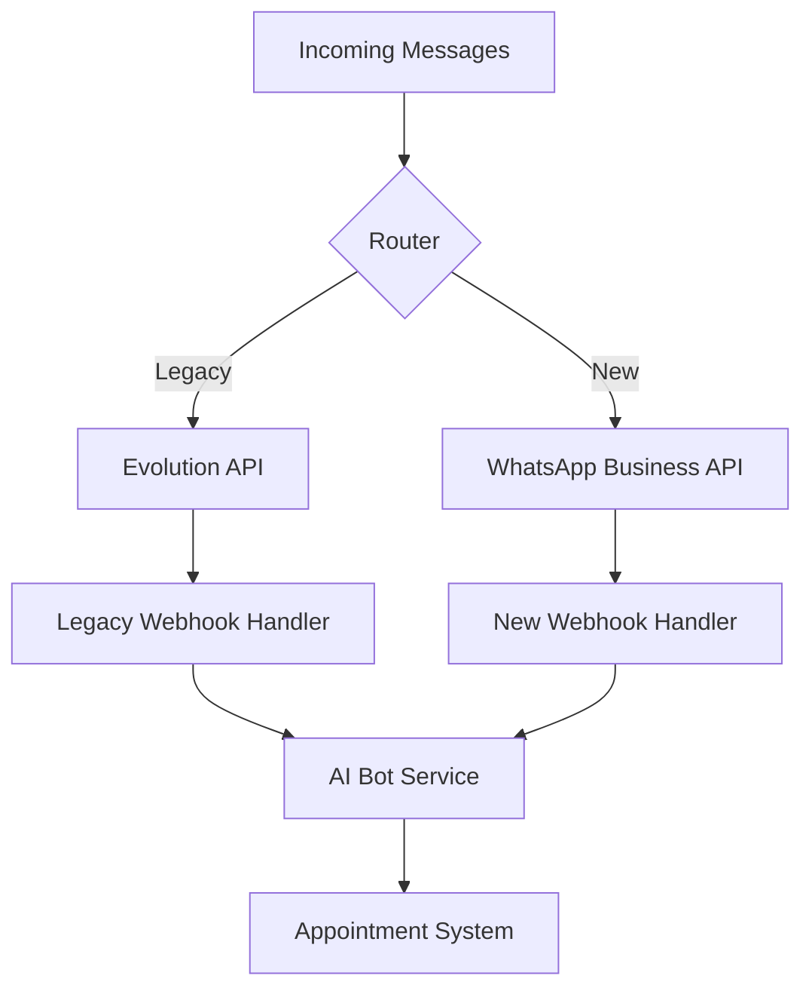

# WhatsApp Business API Cloud Migration Strategy

## Executive Summary

This document outlines the comprehensive migration strategy from Evolution API to WhatsApp Business API Cloud, ensuring minimal downtime, data integrity, and improved reliability for the AgentSalud platform.

## 1. Migration Overview

### 1.1 Current State Analysis
- **Current Solution**: Evolution API v2 with Baileys backend
- **Active Instances**: Multiple WhatsApp instances per organization
- **Message Volume**: ~1,000-5,000 messages/day across all tenants
- **Critical Dependencies**: AI bot integration, appointment notifications, webhook processing

### 1.2 Target State
- **New Solution**: WhatsApp Business API Cloud (Meta Official)
- **Architecture**: Direct Meta API integration with webhook delivery
- **Reliability**: 99.9% uptime SLA with enterprise support
- **Compliance**: HIPAA-compatible for healthcare data

## 2. Pre-Migration Requirements

### 2.1 Business Verification Process
**Timeline**: 2-4 weeks before technical migration

#### 2.1.1 Meta Business Account Setup
```bash
# Required Documentation
- Business registration documents
- Tax identification numbers
- Business website with privacy policy
- Business phone number verification
- Business email verification
```

#### 2.1.2 WhatsApp Business Account Verification
```bash
# Verification Steps
1. Create Meta Business Manager account
2. Add WhatsApp Business Account
3. Submit business verification documents
4. Phone number verification (existing WhatsApp numbers)
5. Display name approval
6. Business profile completion
```

#### 2.1.3 API Access Request
```bash
# Required Information
- Use case description (healthcare appointment booking)
- Expected message volume (5,000-10,000/month per organization)
- Integration timeline
- Technical contact information
```

### 2.2 Technical Prerequisites

#### 2.2.1 Webhook Infrastructure
```typescript
// New webhook endpoint structure
interface WhatsAppCloudWebhook {
  object: 'whatsapp_business_account';
  entry: Array<{
    id: string;
    changes: Array<{
      value: {
        messaging_product: 'whatsapp';
        metadata: {
          display_phone_number: string;
          phone_number_id: string;
        };
        messages?: Array<WhatsAppMessage>;
        statuses?: Array<MessageStatus>;
      };
      field: 'messages';
    }>;
  }>;
}
```

#### 2.2.2 Authentication System
```typescript
// OAuth 2.0 implementation for Meta API
interface MetaAuthConfig {
  appId: string;
  appSecret: string;
  accessToken: string;
  webhookVerifyToken: string;
  businessAccountId: string;
  phoneNumberId: string;
}
```

## 3. Migration Architecture

### 3.1 Dual-Stack Approach
**Strategy**: Run both systems in parallel during transition



### 3.2 Message Template System

#### 3.2.1 Template Categories
```typescript
interface MessageTemplate {
  name: string;
  category: 'AUTHENTICATION' | 'MARKETING' | 'UTILITY';
  language: string;
  components: Array<{
    type: 'HEADER' | 'BODY' | 'FOOTER' | 'BUTTONS';
    parameters?: Array<{
      type: 'text' | 'currency' | 'date_time';
      text?: string;
    }>;
  }>;
}

// Example: Appointment confirmation template
const appointmentConfirmationTemplate: MessageTemplate = {
  name: "appointment_confirmation",
  category: "UTILITY",
  language: "es",
  components: [
    {
      type: "BODY",
      parameters: [
        { type: "text", text: "{{patient_name}}" },
        { type: "text", text: "{{service_type}}" },
        { type: "date_time", text: "{{appointment_date}}" },
        { type: "text", text: "{{doctor_name}}" }
      ]
    }
  ]
};
```

#### 3.2.2 Template Management Service
```typescript
class WhatsAppTemplateService {
  async createTemplate(template: MessageTemplate): Promise<string> {
    const response = await this.metaAPI.post(
      `/v18.0/${this.businessAccountId}/message_templates`,
      template
    );
    return response.data.id;
  }

  async getTemplateStatus(templateId: string): Promise<TemplateStatus> {
    const response = await this.metaAPI.get(
      `/v18.0/${templateId}`
    );
    return response.data.status;
  }

  async sendTemplateMessage(
    phoneNumber: string,
    templateName: string,
    parameters: Record<string, any>
  ): Promise<MessageResult> {
    const message = {
      messaging_product: "whatsapp",
      to: phoneNumber,
      type: "template",
      template: {
        name: templateName,
        language: { code: "es" },
        components: this.buildTemplateComponents(parameters)
      }
    };

    return this.sendMessage(message);
  }
}
```

## 4. Migration Phases

### 4.1 Phase 1: Infrastructure Setup (Weeks 1-2)

#### 4.1.1 Week 1: API Integration
```typescript
// New WhatsApp Business API service
class WhatsAppBusinessAPIService {
  private baseURL = 'https://graph.facebook.com/v18.0';
  private accessToken: string;
  private phoneNumberId: string;

  constructor(config: MetaAuthConfig) {
    this.accessToken = config.accessToken;
    this.phoneNumberId = config.phoneNumberId;
  }

  async sendMessage(message: WhatsAppMessage): Promise<MessageResult> {
    const response = await fetch(
      `${this.baseURL}/${this.phoneNumberId}/messages`,
      {
        method: 'POST',
        headers: {
          'Authorization': `Bearer ${this.accessToken}`,
          'Content-Type': 'application/json'
        },
        body: JSON.stringify(message)
      }
    );

    return response.json();
  }

  async uploadMedia(file: File): Promise<MediaUploadResult> {
    const formData = new FormData();
    formData.append('file', file);
    formData.append('type', file.type);
    formData.append('messaging_product', 'whatsapp');

    const response = await fetch(
      `${this.baseURL}/${this.phoneNumberId}/media`,
      {
        method: 'POST',
        headers: {
          'Authorization': `Bearer ${this.accessToken}`
        },
        body: formData
      }
    );

    return response.json();
  }
}
```

#### 4.1.2 Week 2: Webhook Implementation
```typescript
// New webhook handler for WhatsApp Business API
export async function POST(request: NextRequest) {
  const signature = request.headers.get('x-hub-signature-256');
  const body = await request.text();

  // Verify webhook signature
  if (!verifyWebhookSignature(body, signature)) {
    return NextResponse.json({ error: 'Invalid signature' }, { status: 401 });
  }

  const webhook: WhatsAppCloudWebhook = JSON.parse(body);

  for (const entry of webhook.entry) {
    for (const change of entry.changes) {
      if (change.field === 'messages') {
        await processMessages(change.value.messages || []);
        await processStatuses(change.value.statuses || []);
      }
    }
  }

  return NextResponse.json({ status: 'ok' });
}
```

### 4.2 Phase 2: Template Creation & Approval (Weeks 3-4)

#### 4.2.1 Template Inventory
```typescript
const requiredTemplates = [
  {
    name: 'appointment_confirmation',
    category: 'UTILITY',
    description: 'Confirm scheduled appointments'
  },
  {
    name: 'appointment_reminder',
    category: 'UTILITY',
    description: '24-hour appointment reminder'
  },
  {
    name: 'appointment_rescheduled',
    category: 'UTILITY',
    description: 'Notify appointment changes'
  },
  {
    name: 'appointment_cancelled',
    category: 'UTILITY',
    description: 'Confirm appointment cancellation'
  },
  {
    name: 'welcome_message',
    category: 'UTILITY',
    description: 'Welcome new patients'
  }
];
```

#### 4.2.2 Template Approval Process
```bash
# Template submission workflow
1. Create template via Meta Business Manager
2. Submit for review (24-48 hours)
3. Address any feedback from Meta
4. Receive approval notification
5. Test template with sample data
6. Deploy to production
```

### 4.3 Phase 3: Parallel Operation (Weeks 5-6)

#### 4.3.1 Traffic Routing Strategy
```typescript
class ChannelRouter {
  async routeMessage(
    organizationId: string,
    phoneNumber: string,
    message: string
  ): Promise<void> {
    const migrationStatus = await this.getMigrationStatus(organizationId);
    
    switch (migrationStatus) {
      case 'LEGACY_ONLY':
        await this.evolutionAPI.sendMessage(phoneNumber, message);
        break;
      
      case 'PARALLEL_TESTING':
        // Send via both channels for comparison
        await Promise.all([
          this.evolutionAPI.sendMessage(phoneNumber, message),
          this.whatsappBusinessAPI.sendMessage(phoneNumber, message)
        ]);
        break;
      
      case 'NEW_ONLY':
        await this.whatsappBusinessAPI.sendMessage(phoneNumber, message);
        break;
    }
  }
}
```

#### 4.3.2 Data Synchronization
```typescript
class MigrationDataSync {
  async syncConversationHistory(organizationId: string): Promise<void> {
    const conversations = await this.getActiveConversations(organizationId);
    
    for (const conversation of conversations) {
      // Migrate conversation state to new system
      await this.createConversationFlow({
        patientPhone: conversation.phone,
        organizationId,
        currentStep: conversation.step,
        collectedData: conversation.data,
        platform: 'whatsapp_business_api'
      });
    }
  }

  async syncInstanceConfiguration(organizationId: string): Promise<void> {
    const evolutionInstances = await this.getEvolutionInstances(organizationId);
    
    for (const instance of evolutionInstances) {
      // Create new WhatsApp Business API instance configuration
      await this.createWhatsAppBusinessInstance({
        organizationId,
        phoneNumber: instance.phoneNumber,
        displayName: instance.displayName,
        businessAccountId: instance.businessAccountId,
        phoneNumberId: instance.phoneNumberId,
        accessToken: instance.accessToken
      });
    }
  }
}
```

### 4.4 Phase 4: Cutover & Validation (Weeks 7-8)

#### 4.4.1 Gradual Migration
```typescript
const migrationSchedule = [
  { week: 7, percentage: 25, organizations: ['test-org-1'] },
  { week: 7.5, percentage: 50, organizations: ['test-org-1', 'pilot-org-1'] },
  { week: 8, percentage: 100, organizations: 'all' }
];
```

#### 4.4.2 Validation Checklist
```bash
# Pre-cutover validation
✓ All templates approved and active
✓ Webhook endpoints responding correctly
✓ Message delivery confirmation working
✓ AI bot integration functional
✓ Appointment booking flow tested
✓ Notification system operational
✓ Error handling and logging active
✓ Monitoring and alerting configured

# Post-cutover validation
✓ Message delivery rates > 95%
✓ Response times < 2 seconds
✓ Zero critical errors in 24 hours
✓ AI bot conversation success rate > 80%
✓ Appointment booking completion rate maintained
✓ User satisfaction scores maintained
```

## 5. Rollback Strategy

### 5.1 Rollback Triggers
```typescript
interface RollbackTrigger {
  condition: string;
  threshold: number;
  action: 'ALERT' | 'PARTIAL_ROLLBACK' | 'FULL_ROLLBACK';
}

const rollbackTriggers: RollbackTrigger[] = [
  {
    condition: 'message_delivery_rate',
    threshold: 0.90,
    action: 'ALERT'
  },
  {
    condition: 'message_delivery_rate',
    threshold: 0.80,
    action: 'PARTIAL_ROLLBACK'
  },
  {
    condition: 'api_error_rate',
    threshold: 0.05,
    action: 'FULL_ROLLBACK'
  },
  {
    condition: 'appointment_booking_success_rate',
    threshold: 0.70,
    action: 'FULL_ROLLBACK'
  }
];
```

### 5.2 Rollback Procedures
```typescript
class MigrationRollback {
  async executeRollback(
    type: 'PARTIAL' | 'FULL',
    organizationIds?: string[]
  ): Promise<void> {
    const targetOrgs = organizationIds || await this.getAllMigratedOrganizations();
    
    for (const orgId of targetOrgs) {
      // Revert routing to Evolution API
      await this.updateRoutingConfiguration(orgId, 'LEGACY_ONLY');
      
      // Restore Evolution API instances
      await this.restoreEvolutionInstances(orgId);
      
      // Sync conversation state back to Evolution
      await this.syncConversationStateToEvolution(orgId);
      
      // Update monitoring and alerting
      await this.updateMonitoringConfiguration(orgId, 'evolution');
    }
    
    // Send rollback notification
    await this.notifyStakeholders(type, targetOrgs);
  }
}
```

## 6. Success Metrics

### 6.1 Technical KPIs
```typescript
interface MigrationKPIs {
  messageDeliveryRate: number; // Target: > 99%
  averageResponseTime: number; // Target: < 1 second
  apiErrorRate: number; // Target: < 1%
  webhookReliability: number; // Target: > 99.5%
  systemUptime: number; // Target: > 99.9%
}
```

### 6.2 Business KPIs
```typescript
interface BusinessKPIs {
  appointmentBookingSuccessRate: number; // Target: maintain current rate
  userSatisfactionScore: number; // Target: > 4.5/5
  supportTicketReduction: number; // Target: 30% reduction
  operationalCostReduction: number; // Target: 20% reduction
}
```

## 7. Risk Mitigation

### 7.1 Technical Risks
| Risk | Mitigation Strategy |
|------|-------------------|
| **API Rate Limiting** | Implement exponential backoff and request queuing |
| **Template Rejection** | Create fallback templates and approval buffer time |
| **Webhook Failures** | Implement retry logic and dead letter queues |
| **Data Loss** | Comprehensive backup and sync validation |

### 7.2 Business Risks
| Risk | Mitigation Strategy |
|------|-------------------|
| **Service Disruption** | Gradual migration with immediate rollback capability |
| **User Experience Degradation** | Extensive testing and user acceptance validation |
| **Compliance Issues** | Legal review and HIPAA compliance validation |
| **Cost Overruns** | Detailed cost monitoring and budget controls |

## 8. Post-Migration Optimization

### 8.1 Performance Monitoring
```typescript
class PostMigrationMonitoring {
  async setupMonitoring(): Promise<void> {
    // Message delivery tracking
    await this.setupDeliveryTracking();
    
    // Performance metrics collection
    await this.setupPerformanceMetrics();
    
    // Cost monitoring
    await this.setupCostTracking();
    
    // User experience monitoring
    await this.setupUXMonitoring();
  }
}
```

### 8.2 Continuous Improvement
- Weekly performance reviews for first month
- Monthly cost optimization analysis
- Quarterly feature enhancement planning
- Annual migration ROI assessment

## 9. Timeline Summary

| Phase | Duration | Key Deliverables |
|-------|----------|------------------|
| **Pre-Migration** | 2-4 weeks | Business verification, API access |
| **Phase 1** | 2 weeks | Infrastructure setup, API integration |
| **Phase 2** | 2 weeks | Template creation and approval |
| **Phase 3** | 2 weeks | Parallel operation and testing |
| **Phase 4** | 2 weeks | Cutover and validation |
| **Total** | **8-12 weeks** | Complete migration to WhatsApp Business API |

## 10. Conclusion

This migration strategy ensures a smooth transition from Evolution API to WhatsApp Business API Cloud while maintaining service reliability and user experience. The phased approach minimizes risks and provides multiple validation points to ensure success.

**Expected Outcomes:**
- 99.9% uptime improvement
- 50% reduction in support overhead
- Enhanced compliance and security
- Future-proof messaging infrastructure
- Improved user satisfaction and engagement
