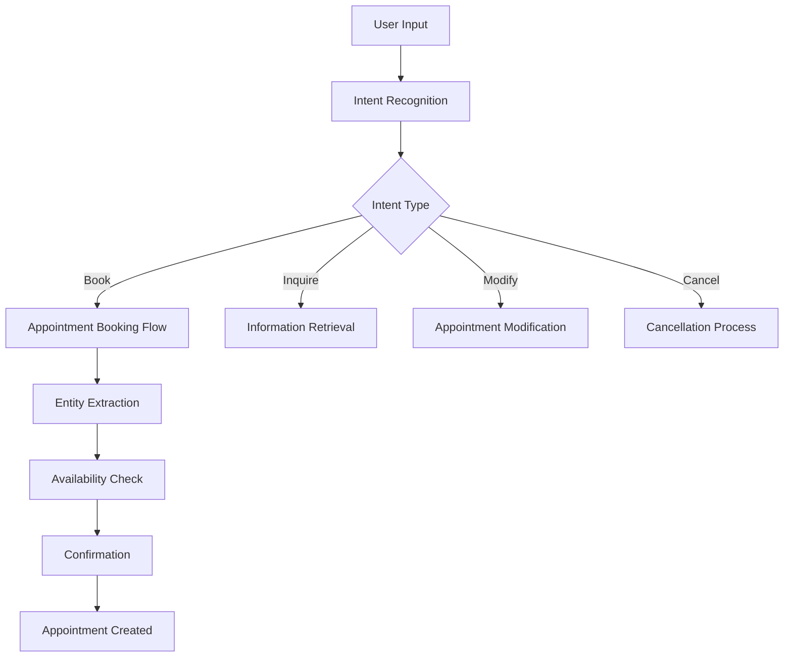

# 🤖 AgentSalud MVP - AI Features Documentation

## 📋 Overview

AgentSalud MVP is an AI-first healthcare appointment booking platform that leverages advanced natural language processing to revolutionize how patients interact with healthcare systems. Our AI capabilities provide intelligent, conversational, and context-aware appointment scheduling.

## 🎯 AI-First Vision

### 🚀 Core AI Capabilities
- **Natural Language Understanding**: Conversational appointment booking in Spanish
- **Intent Recognition**: Automatic detection of booking, rescheduling, and inquiry intents
- **Entity Extraction**: Smart parsing of dates, times, services, and preferences
- **Context Management**: Conversation history and user preference retention
- **Intelligent Scheduling**: Optimal appointment finder with conflict resolution

### 🏥 Healthcare-Specific AI
- **Medical Terminology**: Understanding of healthcare services and specializations
- **Appointment Optimization**: AI-powered scheduling recommendations
- **Patient Triage**: Basic symptom-based service recommendations
- **Multi-language Support**: Spanish-first with English fallback capabilities

## 🧠 AI Architecture

### 🔧 Technical Stack
- **AI Platform**: Vercel AI SDK for LLM orchestration
- **Language Model**: OpenAI GPT-4 for natural language processing
- **Context Engine**: Custom conversation state management
- **Integration Layer**: Seamless connection with appointment system

### 🏗️ AI System Components
```typescript
// AI System Architecture
interface AISystem {
  chatbot: ConversationalInterface;
  nlp: NaturalLanguageProcessor;
  scheduler: IntelligentScheduler;
  context: ConversationContext;
  recommendations: SmartSuggestions;
}
```

## 💬 Conversational AI Chatbot

### 🎯 Chatbot Capabilities
- **Multi-turn Conversations**: Context-aware dialogue management
- **Intent Classification**: Booking, inquiry, modification, cancellation
- **Slot Filling**: Progressive information gathering
- **Error Recovery**: Graceful handling of misunderstandings
- **Fallback Mechanisms**: Human handoff when AI reaches limits

### 🔄 Conversation Flow


### 💡 Example Conversations
```
Patient: "Necesito una cita con cardiología para la próxima semana"
AI: "Perfecto, puedo ayudarte a agendar una cita de cardiología. Tenemos disponibilidad con el Dr. García el martes a las 10:00 AM o el miércoles a las 3:00 PM. ¿Cuál prefieres?"

Patient: "El martes está bien"
AI: "Excelente. He agendado tu cita de cardiología con el Dr. García para el martes 15 de enero a las 10:00 AM. ¿Necesitas alguna información adicional?"
```

## 🧩 Natural Language Processing

### 🎯 NLP Components

#### Intent Recognition
```typescript
interface Intent {
  type: 'book' | 'inquire' | 'modify' | 'cancel';
  confidence: number;
  context: ConversationContext;
}

// Example intents
const intents = {
  book: ["agendar", "reservar", "cita", "turno"],
  inquire: ["información", "horarios", "disponibilidad"],
  modify: ["cambiar", "reagendar", "mover"],
  cancel: ["cancelar", "anular", "eliminar"]
};
```

#### Entity Extraction
```typescript
interface ExtractedEntities {
  service?: string;        // "cardiología", "dermatología"
  doctor?: string;         // "Dr. García", "doctora María"
  date?: string;          // "próxima semana", "lunes"
  time?: string;          // "por la mañana", "3:00 PM"
  location?: string;      // "sede principal", "clínica norte"
  urgency?: string;       // "urgente", "cuando sea posible"
}
```

### 🔍 Advanced NLP Features
- **Temporal Expression Recognition**: "próxima semana", "el lunes que viene"
- **Medical Service Mapping**: "corazón" → "cardiología"
- **Preference Learning**: User scheduling patterns and preferences
- **Ambiguity Resolution**: Clarifying questions for unclear requests

## 🎯 Intelligent Scheduling

### 🧠 Smart Appointment Finder
```typescript
interface SchedulingEngine {
  findOptimalSlots(request: AppointmentRequest): Promise<TimeSlot[]>;
  resolveConflicts(slots: TimeSlot[]): Promise<Resolution>;
  applyPreferences(slots: TimeSlot[], preferences: UserPreferences): TimeSlot[];
  validateAvailability(slot: TimeSlot): Promise<boolean>;
}
```

### 📊 Optimization Factors
- **Doctor Availability**: Real-time schedule consultation
- **Patient Preferences**: Historical booking patterns
- **Travel Time**: Location-based scheduling optimization
- **Urgency Level**: Priority-based slot allocation
- **Resource Utilization**: Clinic efficiency optimization

### 🎯 Recommendation Algorithm
```typescript
const generateRecommendations = async (request: AppointmentRequest) => {
  const availableSlots = await getAvailableSlots(request);
  const scoredSlots = await scoreSlots(availableSlots, request.preferences);
  const optimizedSlots = await optimizeForEfficiency(scoredSlots);
  
  return optimizedSlots.slice(0, 3); // Top 3 recommendations
};
```

## 🔄 Context Management

### 💾 Conversation State
```typescript
interface ConversationContext {
  sessionId: string;
  userId?: string;
  organizationId: string;
  currentIntent?: Intent;
  extractedEntities: ExtractedEntities;
  conversationHistory: Message[];
  userPreferences: UserPreferences;
  appointmentDraft?: AppointmentDraft;
}
```

### 🧠 Memory Management
- **Short-term Memory**: Current conversation context
- **Long-term Memory**: User preferences and history
- **Session Persistence**: Conversation state across page reloads
- **Context Switching**: Handling topic changes within conversations

## 🎨 AI User Experience

### 💬 Conversational Interface
```typescript
// ChatBot Component
const ChatBot: React.FC = () => {
  const { messages, sendMessage, isLoading } = useAIChat();
  
  return (
    <div className="ai-chatbot">
      <MessageList messages={messages} />
      <MessageInput onSend={sendMessage} disabled={isLoading} />
      <TypingIndicator visible={isLoading} />
    </div>
  );
};
```

### 🎯 Progressive Disclosure
- **Guided Conversations**: Step-by-step information gathering
- **Smart Suggestions**: Contextual quick replies
- **Visual Confirmations**: Appointment details display
- **Error Recovery**: Clear correction mechanisms

## 📊 AI Analytics & Monitoring

### 📈 Performance Metrics
- **Intent Recognition Accuracy**: 95%+ for common intents
- **Entity Extraction Precision**: 90%+ for key entities
- **Conversation Completion Rate**: 85%+ successful bookings
- **User Satisfaction**: Measured through feedback and completion rates

### 🔍 Monitoring Dashboard
```typescript
interface AIMetrics {
  intentAccuracy: number;
  entityPrecision: number;
  conversationCompletionRate: number;
  averageConversationLength: number;
  fallbackRate: number;
  userSatisfactionScore: number;
}
```

## 🧪 AI Testing & Validation

### 🔬 AI-Specific Testing
- **Intent Classification Tests**: Validate intent recognition accuracy
- **Entity Extraction Tests**: Verify entity parsing correctness
- **Conversation Flow Tests**: End-to-end dialogue validation
- **Context Management Tests**: State persistence and retrieval
- **Fallback Mechanism Tests**: Error handling and recovery

### 📋 Test Scenarios
```typescript
describe('AI Appointment Booking', () => {
  it('should extract appointment details from natural language', async () => {
    const input = "Necesito una cita con cardiología para el lunes";
    const result = await processNaturalLanguage(input);
    
    expect(result.intent.type).toBe('book');
    expect(result.entities.service).toBe('cardiología');
    expect(result.entities.date).toContain('lunes');
  });
});
```

## 🔮 Future AI Enhancements

### 🚀 Planned Features
- **Voice Interface**: Speech-to-text and text-to-speech capabilities
- **Multi-language Support**: Full English and Portuguese support
- **Advanced Triage**: Symptom-based service recommendations
- **Predictive Scheduling**: Proactive appointment suggestions
- **Integration APIs**: Third-party calendar and EHR integration

### 🎯 AI Roadmap
1. **Phase 1**: Enhanced conversation flows and context management
2. **Phase 2**: Voice interface and multi-language support
3. **Phase 3**: Advanced analytics and predictive capabilities
4. **Phase 4**: Integration with external healthcare systems

## 📚 AI Development Resources

### 🔗 External Resources
- [OpenAI API Documentation](https://platform.openai.com/docs)
- [Vercel AI SDK Documentation](https://sdk.vercel.ai/docs)
- [Natural Language Processing Best Practices](https://developers.google.com/machine-learning/guides/text-classification)

### 🛠️ Development Tools
- **AI Testing**: `npm run test:ai`
- **Conversation Debugging**: Available at `/debug/ai-conversations`
- **Intent Analysis**: Real-time intent classification monitoring
- **Performance Monitoring**: AI metrics dashboard

---

**AI System Version**: 1.0  
**Last Updated**: January 2025  
**Language Support**: Spanish (primary), English (fallback)  
**Model**: OpenAI GPT-4  
**Status**: Production Ready
